**Search for "Exam" to find possible questions and power ups**

# AWS Accounts

- Having multiple accounts (one for dev, one for test another one for prod) can limit the damage if some information is leaked, since they are containers and only the resources of that account can be deleted.


## Setting up basic AWS Account config
- In real world usage, under account settings, fill the alternate contacts list to keep the owners of the accourn on the loop.

- Activate the IAM access to billing information under settings  as well. This way you don't need to be signed in with your root user to see the information.


## MFA (Multi Factor Authentication)

A factor is a piece of evidence that provides an identity

The 4 most common factors are:
1. Knowledge -> Username and passwords
2. Possession -> Bank Card, MFA device (token generator, could be Gmail)
3. Inherent -> Fingerprint, voice, etc.
4. Location -> A network or WIFI


### How to secure an AWS account with MFA?
1. Go to the right top menu and select "security credentials"
2. Go to MFA and select an option (the easiest one is Virtual MFA)
3. Use any third party application to set up the MFA on your mobile phone or PC (google authenticator is the easiest one)


**You should set a different MFA for each user in the account**


## Budgets
### Setting up budget alerts
1. Go to the right top menu and select "billing dashboard"
2. Go to Billing Preferences and check "Receive invoce by email", "Receive Free tier alert" and "receive billing alerts"

### Creating budget
1. In the billing dashboard go to "Budgets" and "Create a new Budget"
    - Enable the cost explorer
2. Create a Cost Budget
    - Monthly, Recurrent, Fixed & the amount you want
3. Create a budget alert between 50%-80%


# IAM (Identity and Access Management)
**It is globally recilient (stored in all the world)**

There are two different types of users in AWS. You are either the account owner (root user) or you are an AWS  IAM user. The only restrictions from IAM compared to the root user is on some billing features and account closure.

### IAM lets you create 3 different types of identity objects:
1. Users -> Humans or applications that need access to your account
2. Groups -> Collection of related users (development team, finance, HR)
3. Roles -> Can be used by AWS Services or to grant external access to your account

The difference between users and roles is that a user is attached to a specific application or human and the role is like a blueprint you can use for any number of services (like a bunch of EC2 instances or an external application trying to use an S3 bucket)


Policies -> Allow or Deny access to AWS Services ONLY WHEN THEY ARE ATTACHED TO ANY OF THE 3 OBJECTS ABOVE


### In general IAM does:

1. Manages Identities - AN ID Provider (IDP)
2. Authenticate
3. Authorize


**You can create an account alias for a friendlier interface**
go to IAM -> left menu you should see a create alias button


### Creating an admin user
go to IAM -> User -> Create new user -> Attach existing policy for AdministratorAccess.


### Access Keys

An IAM user can have 2 access keys at most.

They can be created and deleted or made active or inactive

Access keys are formed by 2 parts:

1. Access Key (similart to a username)
2. Secret Access Key (similar to a password)

You only get the Secret Access Key ID one time, its your responsibility to store it somewhere.


Rotating access keys just means to create a new pair and remove the old one (that's why you can have 2 of them at the same time). update your applications to use that one instead.


### AWS CLI

use

```
aws configure --profile name_of_profile
```
to confgure multiple AWS accounts credentials in your machine.


# Cloud Computing Fundamentals

Characteristics for a system to be considered cloud

1. On-Demand Self-Service
2. Broad Netweork Access
3. Resource Pooling
4. Rapid Elasticity
5. Measured Service


### On-Demand Self-Service
can provision capabilities as needed without requiring human interaction, on demand.


### Broad Network Access
Capabilites are available over the netowork and access through standard mechanisms

### Resource Pooling
No control or knowledge over the EXACT location of the resources.

Resources are pooled to server multiple consumers using a multi-tenant model.

### Rapid Elasticity
Capabilities can be elastically provisioned and released to scale rapidly outward and inward with deman.

To the consumer, the capabilities available for provisioning often appear to be unlimited.

### Measured Service

Resources usage can be monitored, controlled, reported AND billed.


## Public vs Private vs Hybrid vs Multi Cloud

### Public Cloud
Considered public because they meet the 5 essential characteristics listed above AND because its open to the general public.


### Private Cloud on-premises
Using a service from a vendor within premises, this allows 0 latency (usually needed when delaing with huge amount of data processing.) It still needs to meet the 5 cloud characteristics. e.g. (AWS outposts, Azure Stack and Google Anthos)


### Multi Cloud
Using multiple cloud environments (hosting in AWS, Azure, Google Cloud, etc.), this way you are resilient to a vendor.


###  Hbyrid Cloud
Using private and public cloud together.


**NOTE: Having a public cloud + legacy on premises environment, this is called a HBYRID ENVIRONMENT/NETWORK**

## Cloud as a Service [X as a Service] e.g. SaaS

### Infrastructure/Application Stack
A collection of things that a software needs stacked from the botton.

In a stack there are parts that you manage and parts that are managed by your vendor.

**Unit of consumption** - What you consume in a service. Can be a service like Netflix or a service like EC2 instance.

### Infrastructure as a Service (IaaS) e.g. EC2
You pay a fee by time (minute, hour, etc.) and your vendor takes care of everything up to the O/S level. Starting from there is your responsibility to implement the remaining things.

### Platform as a Service (PaaS) e.g. Hosting an app in Heroku or using Beanstalk
Your unit of consumption is the runtime of a runtime environment (python, javascript, etc.)
This is mainly used by developers.

### Software as a Service (SaaS) e.g. Gmail, Dropbox
You consume the application. You pay a monthly fee for it.


# Tech Fundamentals
## YAML
Design to serialize data in a human readable way

Is commonly used for configuration.
Supports lists & dictionaries e.g.


## Networking
OSI 7- Layer Model (Networking Stack)


### Layer 1 (Physical Layer)

If using a shared medium (a HUB) this HUB retransmitt everything that it receives to all of the devices connected. Including Errors and collisions

It's like shouting to a room with other people and not using any names


### Layer 2 (Data Link) e.g. Ethernet
It runs over layer 1

Introduces the concept of Frames (Ethernet frame), which are a format for sending information over a layer 2 network

It introduces MAC address for every device in the network, this address IS NOT software assigned, it is a unique addresses attached to a specific piece of hardware.
It is divided in two parts:

1. Organizational Unique Identifier - (OUI) this one is regarding the producer of the hardware 
2. Network Interface Controller (NIC)

This two parts together is what makes the address unique.


**Frame**
It is a protocolized way of transmitting data used by layer 3. It contains information about the MAC source, MAC destination and the Ether Type (e.g. IP addresses)
It also contains the payload which is between 45-1500 bytes.

**NOTE** When there is no destination MAC address (all Fs) it is known as broadcasting.


Layer 2 checks for a carrier to see if another MAC address is transmitting, if a carrier is detected it waits for it to finish, this way there is no collision of data.

Using a Switch over a HUB is better since it understands layer 2 (hast layer 2 software inside of it) (has a MAC Address table), this means that can avoid collisions


### Layer 3 - Network (IP protocol) (Routers)
The purpose of this layer is to get data from one location to another.

Data are moved in packets (similar to Frames), this contains data to be moved as well as a destination and source addresses.


**IPv4**

AP addresses are separated into two parts the NETWORK identifier and the HOST identifier. To know if two devices are local, you just need to see if both networks are the same.

**A subnet mask is used to identify the network on an IP address**

for example a /16 submask means that the first 2 bytes of the IP is the HOST.

e.g.

133.33.3.7/16

means that the network start is

133.33.0.0

and the network end is 

133.33.255.255

This is used for machines to know when they need to route packets accross different intermediate tables (different hosts) or just to your local LAN.


**Route Tables and Routes**

This table are used by Internet providers to forward your requests to the correct destination. If there are multiple matches it uses the more specifc one. /0 is the least specific /32 is the most specific (it actually is a single IPv4 address since it has all 4 bytes)

If there are no matches it uses the default destination 0.0.0.0/0


**Address Resolution Protocol (ARP)**
When you want to encapsulate an IP Packet into a Frame for a given MAC Address, but you don't know the MAC address of the gateway, that's when you use ARP, this will give you that MAC Address.

This protocol broadcasts in layer 2 asking which device has a certain IP, the device that has that IP responds to the broadcast.


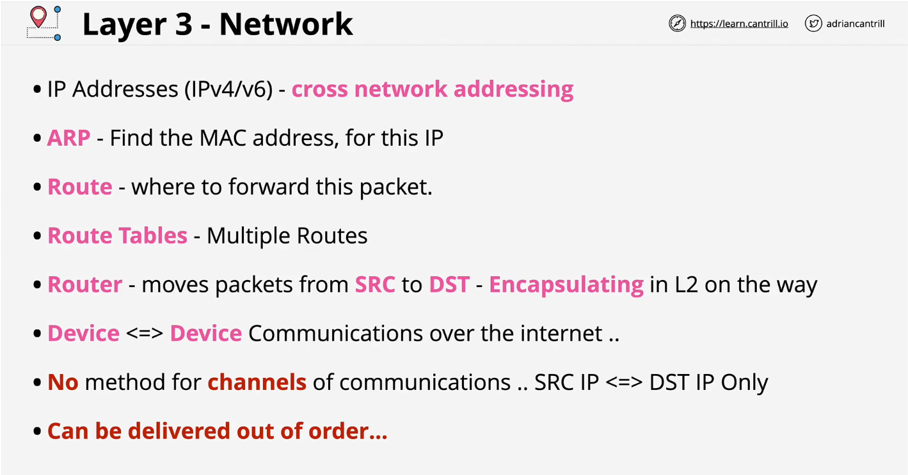


### Layer 4 - Transport (maybe layer 5)

This layer helps to order IP packets.
It also helps to distinguish between applications, since layer 3 does not offer any way to distinguish between two or more connections.

IT introduces two protocols - TCP & UDP

**TCP** - Transmission Control Protocol -This is used for reliability and it is used for HTTP, HTTPS, SSH, etc.
It is a connection oriented protocol, this means you need to set up a connection between the two devices and it creates a bi-directional channel of communication.

**UDP** - User Datagram Protocol - This protocol is less realiable since it does not need the overhead of TCP, but it also has a better performance due to this.


**TCP continuation**

It uses segments which are encapsulated within IP packets.
A segement contains the SOURCE and DESTINATION PORTS. This gives us the ability to have multiple communications to a single IP e.g. TCP port 433 is HTTPS. 

It also contains a SEQUENCE NUMBER, this sequence number contians the order of the packets. This way the evice knows for which segment the IP packet belongs to and also in which order it should go.


The ACKNOWLEDGMENT field is used for letting know the source that it received the package

WINDOW - this field is used for letting the source know how many bytes you can receive between acknowledgement. Once you reach that window, the source pauses until you acknowledge the packages receives. The larger the window the faster the connection since you need less headers.

CHECKSUM - this field is used for error checking and retransmission of data


The Ephemeral port is the port of the client connecting to the server, and the well known port is the port of the server (433 for HTTPS)


The TCP 3-way Handshake

It is used for setting up the connection

first the client needs to inform the server the sequence number. It has the SYN flag set and sends it to the server.

Now that the server knows the sequence number, it creates a segment with the flag SYN-ACK to inform the client that it received the package and also sends its own sequence number and the client sequence number + 1

(sequence number are initialized to a random number for security reasons)

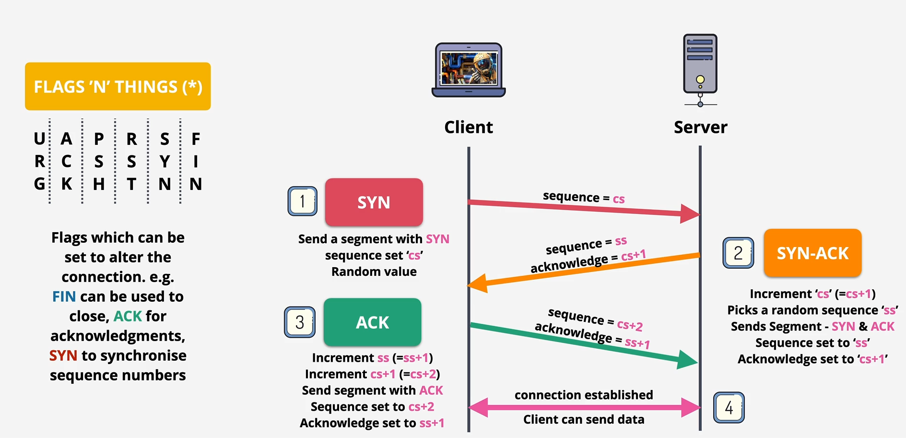


**Firewalls**

Stateless Firewall - It needs both an Outbound rule and Inbound rule. This firewall in AWS is the - Network ACL -


Stateful Firewall - This understands the state of the TCP segment, so if you  allow the initial connection you automatically allow the response. This in AWS is called a Security Group. (This may be considered layer 5 since it knows the session, meaning the on going communication)


### Network Address Translation (NAT)

Is designed to overcome the IPv4 shortages.

It translate private IP addresses to public IP addresses


**Static NAT** - Translate from 1 private to 1 fixed public address. This is called as an Internet Gateway in AWS (IGW)
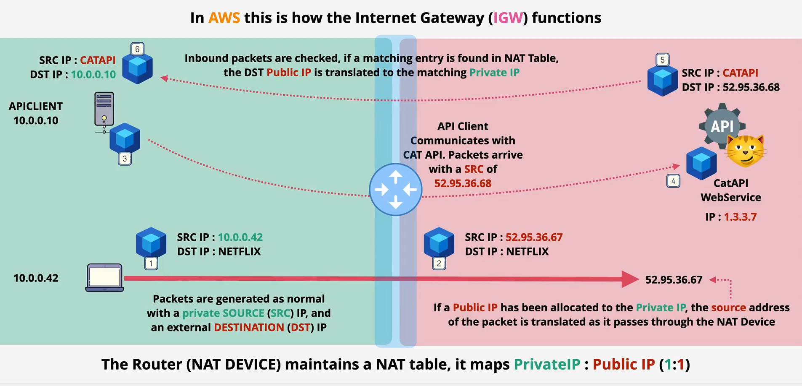

**Dynamic NAT** - Translate 1 private to 1st available Public IP.

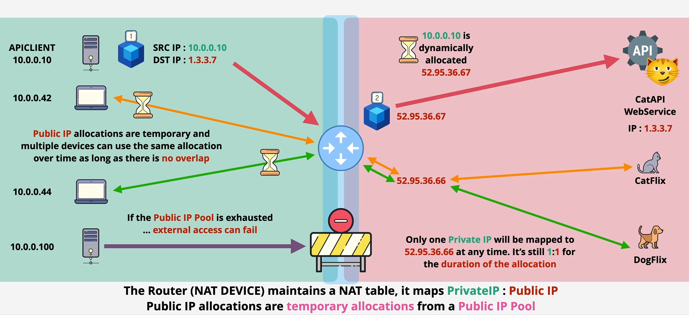


**Port Address Translation (PAT)** many private to 1 public (NATGW) This is used by your home internet router. This method uses ports to help identify the devices.
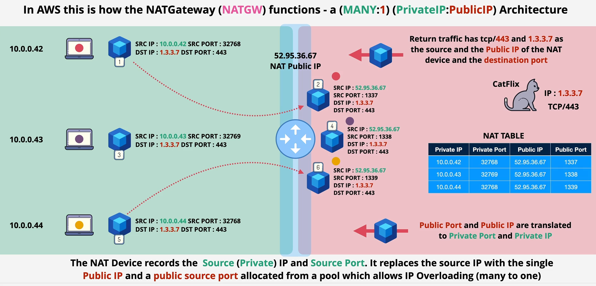

ALL OF THIS IS ONLY FOR IPv4 for IPv6 is not necessary since there are plenty of IPs for all devices.


### IPv4 Addressing
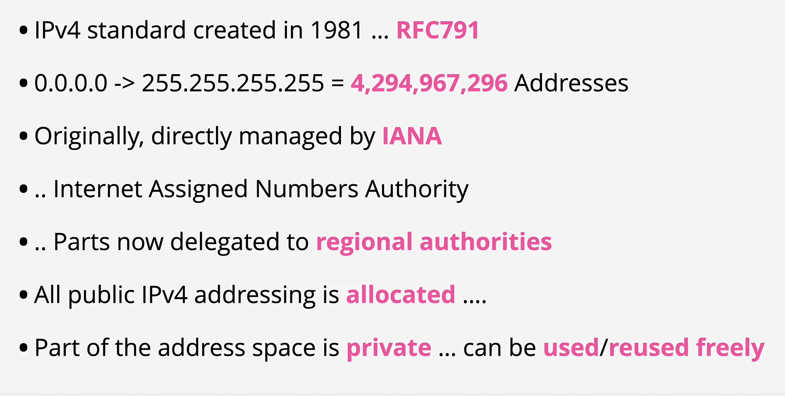


Basically Class A IPs support less networks (only 256) but waaay much more hosts, since each network has 16+ million IPs. They are were used by large companies, and all the classes that follow have the same principle (networks get bigger, but hosts get smaller since they won't probably use that much hosting)
**Private Ranges**

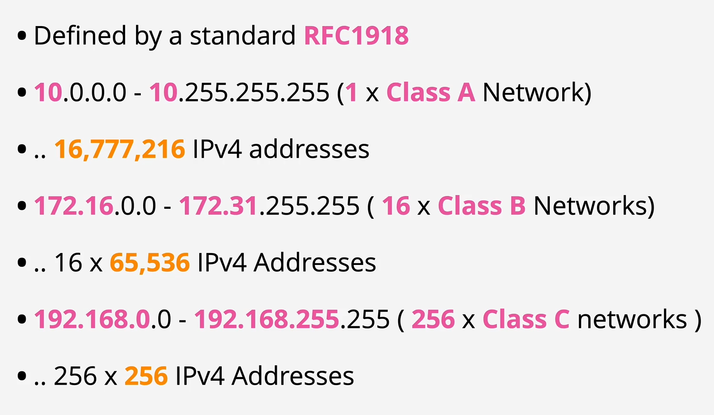


**IPv4 vs IPv6**

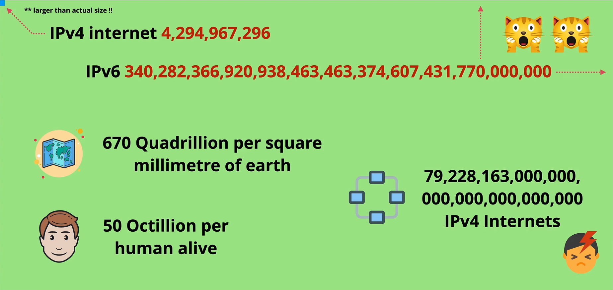


### IPv4 Subnetting
This is breaking a big network into smaller networks by using a subnet.


### DDoS
These attacks are used to deny the service of your applications to any user by overloading your website.


There are 3 main types of DDoS attacks:
1. Application - Uses botnets to request really expensive endpoints
2. Protocol - Uses botnets to attempt to initiate a TCP connection with your servers (3 way handshake) but they use a spoof IP so that the server response never reaches anything and it keeps waiting for a long time.
3. Volumetric - Smaller botnets, they use different DNS servers to send requests using your IP as the source addresss. This makes the DNS servers respond to your website and overloads it.


### SSL and TLS
Gives privacy anmd data integrity between client & server.

TLS - encrypts communications
Identity (server or client/server)

verified, usually the client verifies the server.

Ensures a reliable connection, protects alteration of data in transit.


TLS works as follow:
1. First the client sends a hello message containing the information about the TLS version, supported cipher suites, session ids, etc.
2. The server responds with an agreement of the cipher suite, etc. As well as its certificate published by an CA (Certificate Authority).
3. The client validates the certificate by posting to the CA for checking expiration dates, DNS, etc.
4. If the certification is valid, the client uses the server public key to encrypt a message containing the PRE-MASTER KEY.
5. The server decrypts the pre-master key using its private key and both the client and the server generate the master key, this master key is used for doing symmetric encryption.

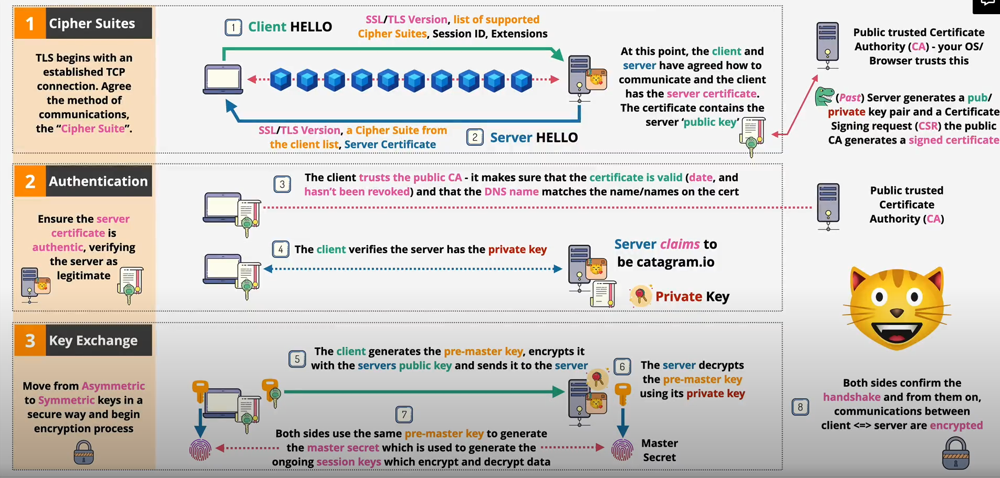


# AWS Fundamentals
AWS services can be categorized into 2 main types
1. Public Services
2. Private Services


This public or private means to the networking only

A public service is something accessed via public endpoints e.g. S3

A private service is something accessed only via the V.P.C


Permissions control the access to a public service and networking manages the access to private service


V.P.C is proportional to your home network, it can only be accessed if you allow it and configure it.


There are 3 different network zones
1. Public internet
2. AWS private zone
3. AWS public zone


You could connect private networks directly to a private zone service, or you could use an internet GateWay to connect you private zone to the public internet.


## AWS Global Infrastructure
AWS Regions

AWS Edge Locations
- Much smaller than regions
- Generally only have content distribution services
- Useful for storing data close to their customers (Netflix)


**There are 3 types of resilience for the AWS services**

1. Globally Resilient (e.g. IAM, route 53) This services can tolerate the failure of multiple regions without impacting service
2. Region Resilient (e.g. RDBS) Operate in a single Region with one set of data per region. This services replicate data to multiple availability zones in that region.

3. AZ Resilient - This services are the least resilient. If the availability zone fails the entire service fails.

## VPC (Virtual Private Cloud)
They are Regional services, meaning that they are regionally resilient


They are, by default, private and isolated unless you decide otherwise

There are two types of VPC
1. Default VPC
2. Custom VPCs

**Exam question: YOU CAN ONLY HAVE 1 DEFAULT VPC BY REGION** 

But you can have as many custom VPCs in a region as you want.

Custom VPCs need to be configured 100% by the user, they are 100% private unless configured otherwise.

Default VPCs are configured by AWS  (1 per region) and they are less flexible (Usually on serious deployments you always work with custom VPCs)

All of the VPCs are allocated a range of IP addresses called the VPC CIDR. 

The default VPC always gets the same CIDR and can only have that CIDR which is the **172.31.0.0/16**


The default VPC ALWAYS have 1 subnet in each availability zone of the region


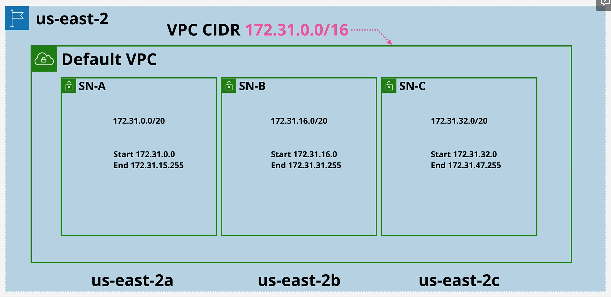


Default VPCs can be deleted and recreated, although some services assume that it is present so it is advised to leave them active, but not use them for any production thing realted.


## EC2
**AZ Resilient**
They are billed by the seconds it was running as well as the storage used or any commercial software that the instanced is launched with.


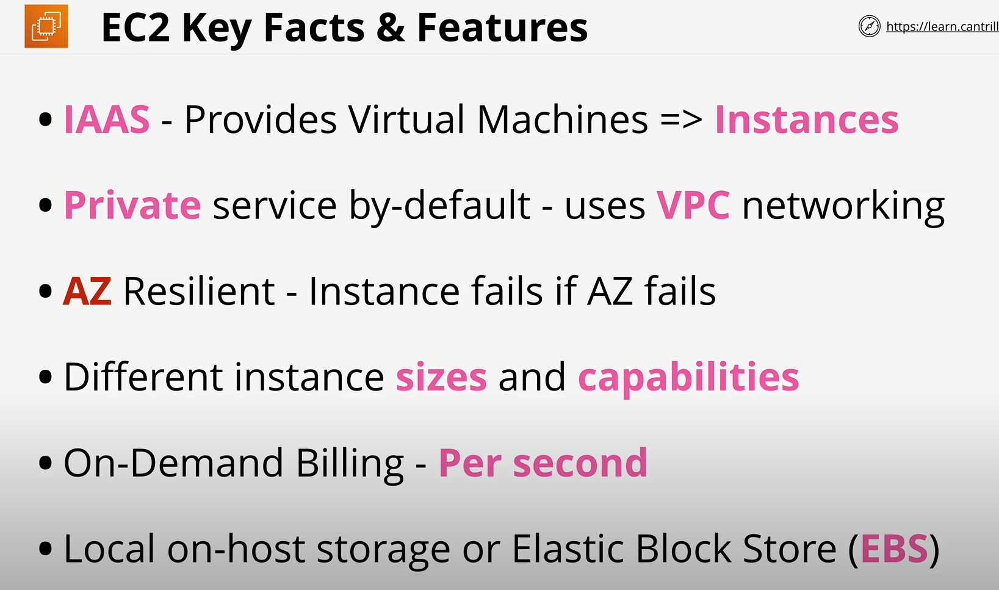


### Instance lyfecycle
It has different states, the main ones are:
1. Running
2. Stopped
3. Terminated


The main difference is that when an instance is stopped you are still being billed by the storage (EBS) where the instance lives, if you terminate it, you are not billed at all, but the instance is now deleted from disk and is not reversible.


### Amazon Machine Image (AMI)
Similar to a server image (ubuntu/windows), but it contains a few important things as well:

It contains attached permissions, this permissions control which accounts can and can't use the AMI.

It contains the Root Volume of the instance. This is the drive that boots the O/S

It contains a Block Device Mapping - This links any volume to the device ID of the O/S (Mapping between volumes and how the O/S sees them) (root volume, data volume, etc.)


### Connecting to EC2
This EC2 can be running different O/S like Windows or Linux

For windows instances you use RDP (Remote Desktop Protocol) this runs on port 3389

For Linux instances you use SSH protocol which use port 22. You login with an SSH key pair


### S3 Basics
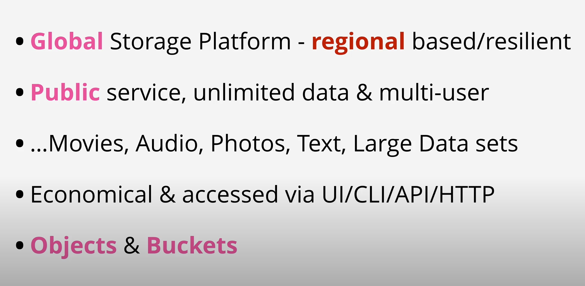

**S3 Objects**


**S3 Buckets**

They are created in a specific region.

You need to configure the S3 if you want the data to leave the region.

**Exam Question: BUCKET NAMES NEED TO BE GLOBALLY UNIQUE**

S3 has a flat structure under the hood.

Folders in S3 are represented when we have object names with "/", these folder are referred to prefixes.


Exam Power Up:


### S3 Patters and Anti patterns
S3 is an object storage system, not a file system or a block storage. 

You can mount an s3 bucket into a O/S, for this you should use EBS (Elastic Block Storage). EBS only allows one thing accessing at a time, S3 does not have that limitation.

It is great for offloading data, instead of your EC2 saving it, you send it to S3

It should be your INPUT or OUTPUT to many aws services


### CloudFormation Basics
Lets you create, update or delete infrastructure in AWS in a consistent and repeteable way by using templates.

**Template Keys**

- Resources: All cloudformation always have the Resources key (it's mandatory)

- Description: You can add a Description key for specifying the author, the use case, etc.

- AWSTemplateFormatVersion: Lets you set the version of the template.


**Exam Question: If you used the key AWSTemplateFormatVersion you need to put the Description right after it.**

- Metadata: It controls how the UI is showed to the user. Generally if your template is used by a large number of users, the bigger the metadata section.

- Parameters: This prompts the user for information. You can apply default values.


- Mappings: It allows you to create lookup tables. For example If region is us-east-1 use this EC2 image, etc.

- Conditions: Allows you to create conditions, (for example if EnvType is prod) and then you can use those conditions in the Resources so that only when the condition is met a certain resource is created.

- Outputs: Are a way that once the template is finished it can return certain values as outputs (like admin password for a blog)


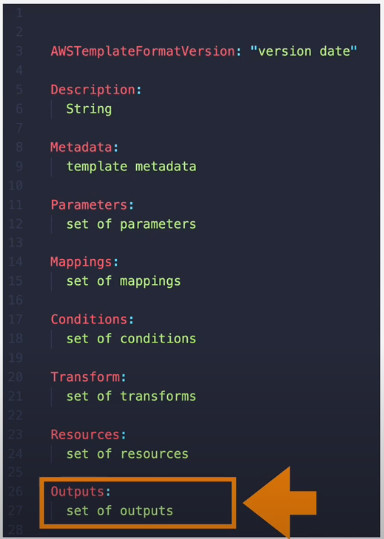


## Cloudwatch
Collects and manages operational data on your behalf

Some metrics are gathered naitively (default) in a product.

You can monitor external things by installing the cloudwatch agent.


It has 3 main features or products in one:

1. Cloudwatch itself (Metrics) [CPU utilization, visitis to a website, etc.]
2. Cloudwatch Logs - Anything that can be logged, it can be ingested
3. Cloudwatch Events - This events can perform other actions and can be triggered by something happening on a service or by schedule.


**Namespaces**

The namespaces are used for containing related metrics, there are default namespaces that AWS creates. e.g. AWS/EC2


**Metric**

A metric is a collection of related data points in a time ordered structure (CPU Usage, Network IN/OUT, etc.)

**Dimensions**

They are used to separate datapoints for different things within the same metric e.g. InstanceID, InstanceType, etc.


**The metris can be linked to alarm and this alarms can have an OK status, an ALARM state, which you can link an action to it (send a SNS message), or in a insufficient data state.**


## Shared Responsibility Model

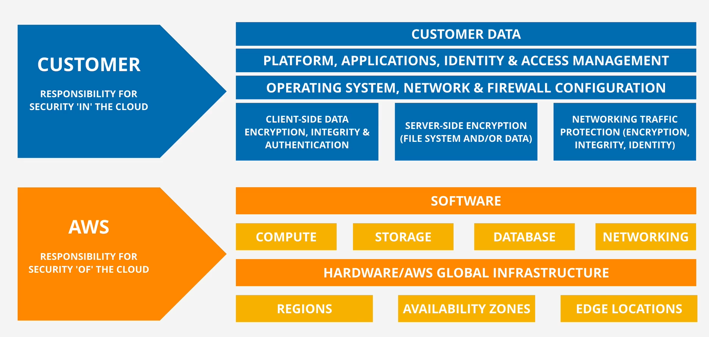


## High-Availability vs Fault-Tolerance vs Disaster Recovery

**High Availability (HA)**

Maximizing a systems online time.

You can have user disruption but still be highly available. Maybe users had re-login or re run a job, but if your service was only down for a small amount of time, it is still HA.

It requires redundant servers or infrastructure as well as automation.


**Fault-Tolerance (FT)**

**HARDER TO DESIGN, HARDER TO IMPLEMENT AND MORE EXPENSIVE THAN HIGH AVAILABILITY.**

FT means that the system NEEDS to keep operating properly in the event of one or more failures.


You first need to minimize outage which is HA, BUT at the same time you need to design a system to tolerate a failure which means having high level of redundancy and system components able to route any traffic around a failed component.


**Disaster Recovery (DR)**

Multiple stage set of processes.

A set of policies, tools and procedures to enable the recovery following a natural or human induced disaster.


Taking regular back-ups in different sites where your system are stored (off-site)


## DNS 101
Is a discovery service by translating human to machine information and vice-versa


It's a huge DB and HAS top be distributed.


It's components are:

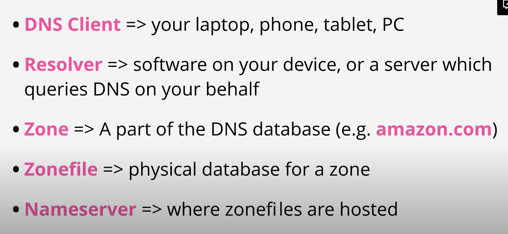

The Resolver needs to locate the correct Nameserver for the Zone, query the Namerserver, rerieve the Zonefile and pass it to the DNSClient.


**DNS Root**

There are 13 special name servers known as the "Root Servers", these servers are operated by 12 different large companies or organizations (this servers can be a cluster of servers, but they are managed by 1 organization). Only VeriSign manages 2 of these servers.

These organizations are only responsible of hosting the servers, the actual Root Zone (the DB) is managed by an organization called, IANA.

The root needs to be a trusted entity, that's the reason why your O/S or internet provider has a Root Hints File, this file is a list of this root servers.

1. Your DNS Client (laptop) asks a DNS resolver the IP of a DNS name
2. The DNS Resolver uses the Hint File to communicate with one or more of the DNS Root servers to access the Root Zone.

Authoritative means that it is trusted to route for a specific DNS, the root zone at first is the only thing that is authoritative in DNS. This root zone delegates to another zone for a particular DNS, this zone then becomes authoritative ONLY for that part (.com, .org, etc.) since the root zone is ONLY authoritative for the top level zones (.com, .org, .net)


## Route53 Basics

1. Register Domains
2. Host Zones.. managed nameservers

It is a global service with a single database

This database is globally resilient


**Register Domains**

It has relationships with all of the major domain registries (.com, .net, etc)


How it works is:
1. First it checks if the domain is available for that top level domain.
2. Then Route53 creates a zone file for the domain being registered. (this zone file can be seen as a database that contains all the info for a particular domain)
3. Route53 allocate nameservers for the zone (4 of them), it puts the zone file in these 4 managed services
4. It add the nameserver record into the zone file for the .com/.org top level domain by using nameserver records.


**Zones**

Zone files in AWS are called hosted zones

They are hosted on four managed name servers

A hosted zone can be public (they live in the AWS public zone [internet])

A hosted zone might be private... linked to a VPC

Ahosted zone hosts DNS records.

Inside Route53 the records are called recordsets


## DNS Record Types

- Namerservers (NS) = Allow delegation to occur, you can have multiple of these pointing to the same DNS, and that means that all of those servers are the Zone for that particular domain


- A and AAAA Records = These records map a hostname to an IP, the only difference between them is that the A links to an IPv4 and the AAAA links to an IPv6 (usually you create two records with the same name, one for A and another one for AAAA)


- CNAMEs = For a given zone, these records are shortcuts, they do not point to a specific IP, they reference an A record, this is used to avoid overhead (you only change one record instead of N)

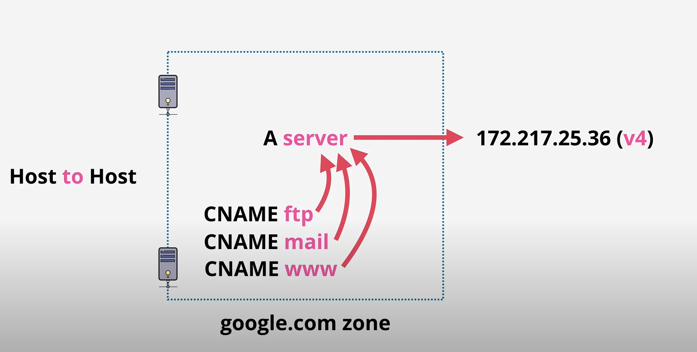


- MX Records = Are used for email, they work the same as an A record but it uses the domain (whatever is after the @) to query de root servers to get into the domain Zone (e.g. @gmail.com => google.com) and then inside the zone it queries for the MX records.

- TXT Records = Allows you to add arbitrary text to a domain, one common usage is to prove domain ownership, for example adding a random phrase to prove you own the record.


**TTL (Time To Live)**

This is the amount of time the authoritative answer will be cached (The result of walking the tree which is an IP linked to a DNS). If another client asks for the same DNS before the TTL expires, they will receive the Non-Authoritative answer that was cached.


# IAM, Accounts and AWS Organizations

## IAM Identity Policies
- It is a group of statements
- Each statement grant or deny permissions to AWS Services
- A statement has 4 main keys:
    1. Sid -> The ID (optional) (Best practice is to use it)
    2. Effect -> Either "Allow" or "Deny"
    3. Action -> The action/s to be done (service:operation)(you can use wildcards)
    4. Resource -> List of the resources (can use wildcards as well) You need to use ARNs


How to handle statements overlaps?


1. First AWS looks for Explicit Denies
2. Then it looks for Explicit Allows
3. If no Allow or Deny -> Defaults to Deny

Deny always take priorty over Allows


When a user tries to access a service, AWS collects all the policies from the user, groups where the user forms part of and the resource itself and evaluate them all as a bunch.

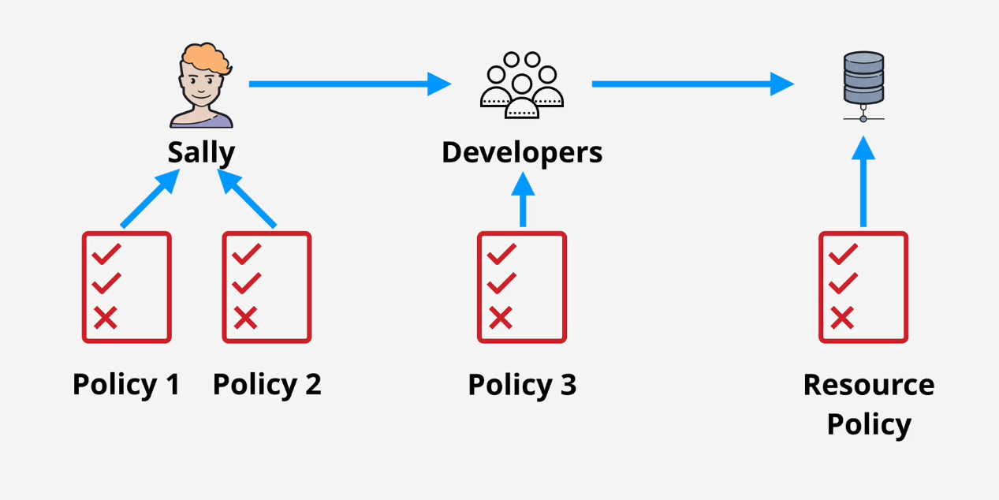


**Inline policies vs managed policies**

- An inline policy is attached directly to the identity
- Managed policies exists as their own and you attached them to identities. This helps to be more reusable and low management overhead.


Inline policies should only be used as exceptions

There are two main types of managed policies, AWS managed policies and custom made policies.


## IAM Users
IAM Users are an identity used for anything that requires long-term access to AWS.

Examples of this are humans, applications or service accounts.


Principals need to authenticate themselves via User and Password or Access keys to prove IAM their identity.

The principal then becames an authenticated identity.

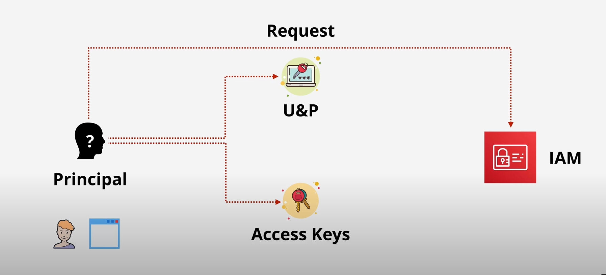


Authentication is the process of proving your identity

Authorization is the process of AWS granting or denying an authenticated identity the permission to perform an action.


**ARN**

- Identifies a single resource
- They have a defined format


On S3 buckets you dont need a region or account ID since they are globally unique


You can use a * for regions, usually you only need to use :: on places where you DONT need to specify, otherwise use * to denote all of them.


The partition field is always aws unless you have in other regions, for example China

the service is the service namespace (se, iam, rds)

region one is obvious

account-id is obvious as well (some resources don't need it as well)

resource-id/resource-type can be the name of a user or an instance name

EXAM POWER UP
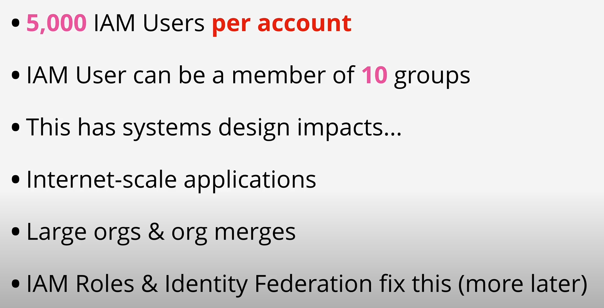


## IAM Groups
- This are containers for Users
- Exam Question: You CAN'T log in into a group, they have no credentials.
- They are used solely for organizing IAM Users.
- They can have Inline or Managed policies attached
- Exam Question: There isn't a group by default that contains all users although you can create one like that.
- You can't have groups within groups
- There is a soft limit of 300 groups
- Groups are NOT a true identity. They CAN'T be referenced as a principal in a policy (e.g. you cant create an inline policy in an s3 bucket to grant acess to a group, but you can do it for a user)


## IAM Roles
- Multiple Users/applications (principals)
- If you are not sure how many of these principals you are gonna have, the best way to go use is using a role
- They are usually used for a short period of time
- IAM Roles have 2 TYPES OF POLICIES
    1. Trust Policies
    2. Permissions Policy

1. Trust Policies -> Controls which identities/services/roles can and can't assume the role in the same or in other AWS accounts (even allow anonymous users or other types of identities such as Facebook, Google, etc.)

2. Permissions Policies -> These are the regular policies but how does AWS manages them for roles? = If an identity is allowed to assume the role, AWS creates temporary security credentials for the identity (they are time limited), once they expire the identity needs to renew them by REASSUMING the role.


Usually roles are used in AWS organizations to allows to log in into one account and access different accounts without having to log in again.

STS (Secure Token Service) is the service that manages the creation of the temporary credentials for roles.

**sts:AssumeRole** is the operation used for assuming the role and getting the credentials.


### When to use IAM Roles???

- AWS Lambda (Function as a Service)

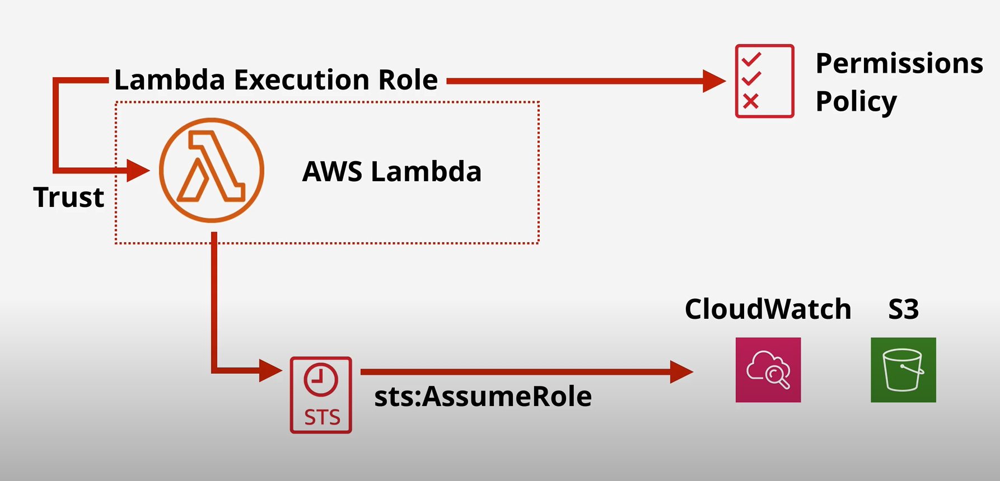


- For Emergency situations (when a customer service needs to terminate an instance for example, this is referred as break glass situation)


- For giving access to users that are part of other organization like Azure, and specially if they are over 5,000. This way they assume the role and get temporary keys.
THIS IS CALLED ID FEDERATION


Exam question: When dealing with architecture for mobile apps user access (potentially millions of them) using ID Federations (IAM Roles) is the best way


## Serviced-linked roles


## AWS Organizations
A product that allows larger business to manage multiple AWS accounts in a cost effective way

- [Management Account] AWS Organization is created via a single AWS Account, the Management Account, this account its not within the organization, and the organization DOES NOT live inside this account.
- Using the management account you can invite other standard accounts to be part of the organization, when they decide to join the become member accounts.


Organizations have two types of "containers" the Root and the Unit.

The root stands at the top and can be one or more member accounts (or the management account), it can also contain other containers (Orgniazational Units [OU])

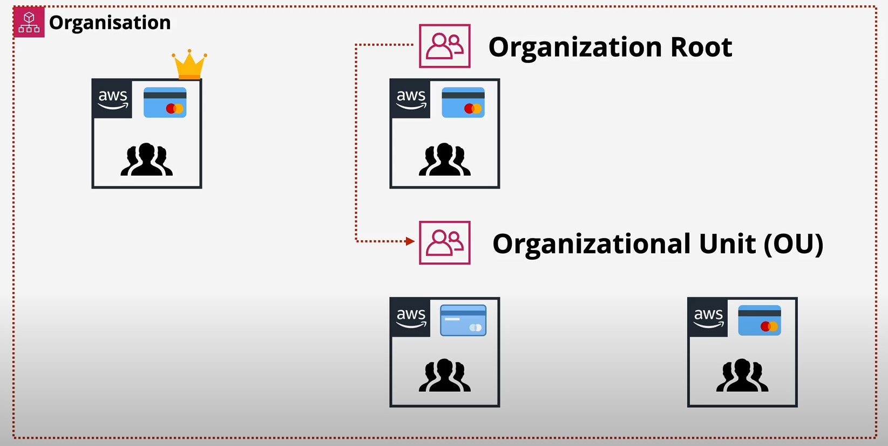


**Consolidated Billing**

Individual billing methods are removed from the member accounts, and now they pass that billing to the management account (payer account)


- You can also create new accounts within organizations (directly in the organization), this way the account does not need be invited and then accept the invitation


BEST PRACTICES:

The best practices with organizations is to have a single account that handles all the IAM identities, this could be the management account or another account. You can also configure in this IAM account, using ID Federation, to use your own internal log in system for logging into AWS.


**When you add an existing account to be part of the organization you need to MANUALLY CREATE the "OrganizationAccountAccessRole"**

If the account was created directly via the management account, this role will be created for you by default.


