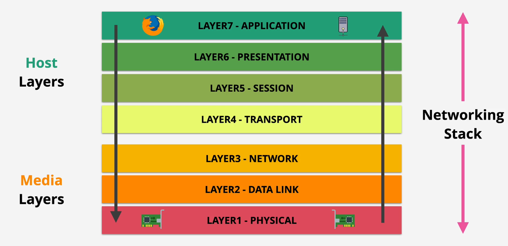
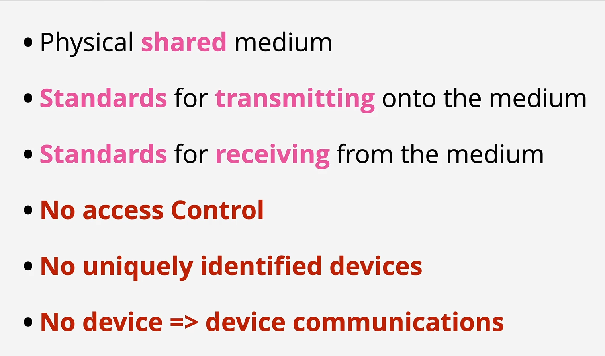
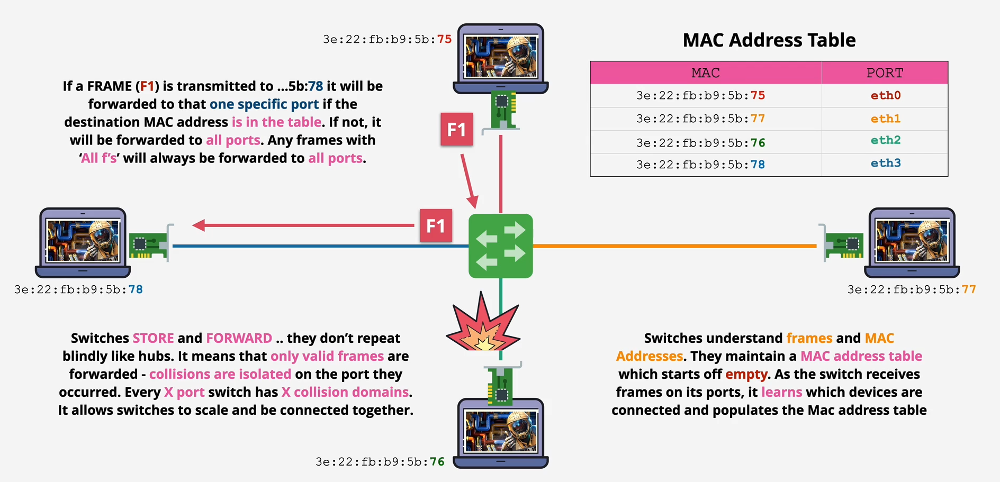

# AWS Accounts

- Having multiple accounts (one for dev, one for test another one for prod) can limit the damage if some information is leaked, since they are containers and only the resources of that account can be deleted.


## Setting up basic AWS Account config
- In real world usage, under account settings, fill the alternate contacts list to keep the owners of the accourn on the loop.

- Activate the IAM access to billing information under settings  as well. This way you don't need to be signed in with your root user to see the information.


## MFA (Multi Factor Authentication)

A factor is a piece of evidence that provides an identity

The 4 most common factors are:
1. Knowledge -> Username and passwords
2. Possession -> Bank Card, MFA device (token generator, could be Gmail)
3. Inherent -> Fingerprint, voice, etc.
4. Location -> A network or WIFI


### How to secure an AWS account with MFA?
1. Go to the right top menu and select "security credentials"
2. Go to MFA and select an option (the easiest one is Virtual MFA)
3. Use any third party application to set up the MFA on your mobile phone or PC (google authenticator is the easiest one)


**You should set a different MFA for each user in the account**


## Budgets
### Setting up budget alerts
1. Go to the right top menu and select "billing dashboard"
2. Go to Billing Preferences and check "Receive invoce by email", "Receive Free tier alert" and "receive billing alerts"

### Creating budget
1. In the billing dashboard go to "Budgets" and "Create a new Budget"
    - Enable the cost explorer
2. Create a Cost Budget
    - Monthly, Recurrent, Fixed & the amount you want
3. Create a budget alert between 50%-80%


# IAM (Identity and Access Management)
**It is globally recilient (stored in all the world)**

There are two different types of users in AWS. You are either the account owner (root user) or you are an AWS  IAM user. The only restrictions from IAM compared to the root user is on some billing features and account closure.

### IAM lets you create 3 different types of identity objects:
1. Users -> Humans or applications that need access to your account
2. Groups -> Collection of related users (development team, finance, HR)
3. Roles -> Can be used by AWS Services or to grant external access to your account

The difference between users and roles is that a user is attached to a specific application or human and the role is like a blueprint you can use for any number of services (like a bunch of EC2 instances or an external application trying to use an S3 bucket)


Policies -> Allow or Deny access to AWS Services ONLY WHEN THEY ARE ATTACHED TO ANY OF THE 3 OBJECTS ABOVE


### In general IAM does:

1. Manages Identities - AN ID Provider (IDP)
2. Authenticate
3. Authorize


**You can create an account alias for a friendlier interface**
go to IAM -> left menu you should see a create alias button


### Creating an admin user
go to IAM -> User -> Create new user -> Attach existing policy for AdministratorAccess.


### Access Keys

An IAM user can have 2 access keys at most.

They can be created and deleted or made active or inactive

Access keys are formed by 2 parts:

1. Access Key (similart to a username)
2. Secret Access Key (similar to a password)

You only get the Secret Access Key ID one time, its your responsibility to store it somewhere.


Rotating access keys just means to create a new pair and remove the old one (that's why you can have 2 of them at the same time). update your applications to use that one instead.


### AWS CLI

use

```
aws configure --profile name_of_profile
```
to confgure multiple AWS accounts credentials in your machine.


# Cloud Computing Fundamentals

Characteristics for a system to be considered cloud

1. On-Demand Self-Service
2. Broad Netweork Access
3. Resource Pooling
4. Rapid Elasticity
5. Measured Service


### On-Demand Self-Service
can provision capabilities as needed without requiring human interaction, on demand.


### Broad Network Access
Capabilites are available over the netowork and access through standard mechanisms

### Resource Pooling
No control or knowledge over the EXACT location of the resources.

Resources are pooled to server multiple consumers using a multi-tenant model.

### Rapid Elasticity
Capabilities can be elastically provisioned and released to scale rapidly outward and inward with deman.

To the consumer, the capabilities available for provisioning often appear to be unlimited.

### Measured Service

Resources usage can be monitored, controlled, reported AND billed.


## Public vs Private vs Hybrid vs Multi Cloud

### Public Cloud
Considered public because they meet the 5 essential characteristics listed above AND because its open to the general public.


### Private Cloud on-premises
Using a service from a vendor within premises, this allows 0 latency (usually needed when delaing with huge amount of data processing.) It still needs to meet the 5 cloud characteristics. e.g. (AWS outposts, Azure Stack and Google Anthos)


### Multi Cloud
Using multiple cloud environments (hosting in AWS, Azure, Google Cloud, etc.), this way you are resilient to a vendor.


###  Hbyrid Cloud
Using private and public cloud together.


**NOTE: Having a public cloud + legacy on premises environment, this is called a HBYRID ENVIRONMENT/NETWORK**

## Cloud as a Service [X as a Service] e.g. SaaS

### Infrastructure/Application Stack
A collection of things that a software needs stacked from the botton.

In a stack there are parts that you manage and parts that are managed by your vendor.

**Unit of consumption** - What you consume in a service. Can be a service like Netflix or a service like EC2 instance.

### Infrastructure as a Service (IaaS) e.g. EC2
You pay a fee by time (minute, hour, etc.) and your vendor takes care of everything up to the O/S level. Starting from there is your responsibility to implement the remaining things.

### Platform as a Service (PaaS) e.g. Hosting an app in Heroku or using Beanstalk
Your unit of consumption is the runtime of a runtime environment (python, javascript, etc.)
This is mainly used by developers.

### Software as a Service (SaaS) e.g. Gmail, Dropbox
You consume the application. You pay a monthly fee for it.


# Tech Fundamentals
## YAML
Design to serialize data in a human readable way

Is commonly used for configuration.
Supports lists & dictionaries e.g.


## Networking
OSI 7- Layer Model (Networking Stack)



### Layer 1 (Physical Layer)

If using a shared medium (a HUB) this HUB retransmitt everything that it receives to all of the devices connected. Including Errors and collisions

It's like shouting to a room with other people and not using any names





### Layer 2 (Data Link) e.g. Ethernet
It runs over layer 1

Introduces the concept of Frames (Ethernet frame), which are a format for sending information over a layer 2 network

It introduces MAC address for every device in the network, this address IS NOT software assigned, it is a unique addresses attached to a specific piece of hardware.
It is divided in two parts:

1. Organizational Unique Identifier - (OUI) this one is regarding the producer of the hardware 
2. Network Interface Controller (NIC)

This two parts together is what makes the address unique.


**Frame**
It is a protocolized way of transmitting data used by layer 3. It contains information about the MAC source, MAC destination and the Ether Type (e.g. IP addresses)
It also contains the payload which is between 45-1500 bytes.

**NOTE** When there is no destination MAC address (all Fs) it is known as broadcasting.


Layer 2 checks for a carrier to see if another MAC address is transmitting, if a carrier is detected it waits for it to finish, this way there is no collision of data.

Using a Switch over a HUB is better since it understands layer 2 (hast layer 2 software inside of it) (has a MAC Address table), this means that can avoid collisions





### Layer 3 - Network (IP protocol) (Routers)
The purpose of this layer is to get data from one location to another.

Data are moved in packets (similar to Frames), this contains data to be moved as well as a destination and source addresses.

