**Search for "Exam" to find possible questions and power ups**

# AWS Accounts

- Having multiple accounts (one for dev, one for test another one for prod) can limit the damage if some information is leaked, since they are containers and only the resources of that account can be deleted.

## Setting up basic AWS Account config

- In real world usage, under account settings, fill the alternate contacts list to keep the owners of the accourn on the loop.

- Activate the IAM access to billing information under settings as well. This way you don't need to be signed in with your root user to see the information.

## MFA (Multi Factor Authentication)

A factor is a piece of evidence that provides an identity

The 4 most common factors are:

1. Knowledge -> Username and passwords
2. Possession -> Bank Card, MFA device (token generator, could be Gmail)
3. Inherent -> Fingerprint, voice, etc.
4. Location -> A network or WIFI

### How to secure an AWS account with MFA?

1. Go to the right top menu and select "security credentials"
2. Go to MFA and select an option (the easiest one is Virtual MFA)
3. Use any third party application to set up the MFA on your mobile phone or PC (google authenticator is the easiest one)

**You should set a different MFA for each user in the account**

## Budgets

### Setting up budget alerts

1. Go to the right top menu and select "billing dashboard"
2. Go to Billing Preferences and check "Receive invoce by email", "Receive Free tier alert" and "receive billing alerts"

### Creating budget

1. In the billing dashboard go to "Budgets" and "Create a new Budget"
   - Enable the cost explorer
2. Create a Cost Budget
   - Monthly, Recurrent, Fixed & the amount you want
3. Create a budget alert between 50%-80%

# IAM (Identity and Access Management)

**It is globally recilient (stored in all the world)**

There are two different types of users in AWS. You are either the account owner (root user) or you are an AWS IAM user. The only restrictions from IAM compared to the root user is on some billing features and account closure.

### IAM lets you create 3 different types of identity objects:

1. Users -> Humans or applications that need access to your account
2. Groups -> Collection of related users (development team, finance, HR)
3. Roles -> Can be used by AWS Services or to grant external access to your account

The difference between users and roles is that a user is attached to a specific application or human and the role is like a blueprint you can use for any number of services (like a bunch of EC2 instances or an external application trying to use an S3 bucket)

Policies -> Allow or Deny access to AWS Services ONLY WHEN THEY ARE ATTACHED TO ANY OF THE 3 OBJECTS ABOVE

### In general IAM does:

1. Manages Identities - AN ID Provider (IDP)
2. Authenticate
3. Authorize

**You can create an account alias for a friendlier interface**
go to IAM -> left menu you should see a create alias button

### Creating an admin user

go to IAM -> User -> Create new user -> Attach existing policy for AdministratorAccess.

### Access Keys

An IAM user can have 2 access keys at most.

They can be created and deleted or made active or inactive

Access keys are formed by 2 parts:

1. Access Key (similart to a username)
2. Secret Access Key (similar to a password)

You only get the Secret Access Key ID one time, its your responsibility to store it somewhere.

Rotating access keys just means to create a new pair and remove the old one (that's why you can have 2 of them at the same time). update your applications to use that one instead.

### AWS CLI

use

```
aws configure --profile name_of_profile
```

to confgure multiple AWS accounts credentials in your machine.

# Cloud Computing Fundamentals

Characteristics for a system to be considered cloud

1. On-Demand Self-Service
2. Broad Netweork Access
3. Resource Pooling
4. Rapid Elasticity
5. Measured Service

### On-Demand Self-Service

can provision capabilities as needed without requiring human interaction, on demand.

### Broad Network Access

Capabilites are available over the netowork and access through standard mechanisms

### Resource Pooling

No control or knowledge over the EXACT location of the resources.

Resources are pooled to server multiple consumers using a multi-tenant model.

### Rapid Elasticity

Capabilities can be elastically provisioned and released to scale rapidly outward and inward with deman.

To the consumer, the capabilities available for provisioning often appear to be unlimited.

### Measured Service

Resources usage can be monitored, controlled, reported AND billed.

## Public vs Private vs Hybrid vs Multi Cloud

### Public Cloud

Considered public because they meet the 5 essential characteristics listed above AND because its open to the general public.

### Private Cloud on-premises

Using a service from a vendor within premises, this allows 0 latency (usually needed when delaing with huge amount of data processing.) It still needs to meet the 5 cloud characteristics. e.g. (AWS outposts, Azure Stack and Google Anthos)

### Multi Cloud

Using multiple cloud environments (hosting in AWS, Azure, Google Cloud, etc.), this way you are resilient to a vendor.

### Hbyrid Cloud

Using private and public cloud together.

**NOTE: Having a public cloud + legacy on premises environment, this is called a HBYRID ENVIRONMENT/NETWORK**

## Cloud as a Service [X as a Service] e.g. SaaS

### Infrastructure/Application Stack

A collection of things that a software needs stacked from the botton.

In a stack there are parts that you manage and parts that are managed by your vendor.

**Unit of consumption** - What you consume in a service. Can be a service like Netflix or a service like EC2 instance.

### Infrastructure as a Service (IaaS) e.g. EC2

You pay a fee by time (minute, hour, etc.) and your vendor takes care of everything up to the O/S level. Starting from there is your responsibility to implement the remaining things.

### Platform as a Service (PaaS) e.g. Hosting an app in Heroku or using Beanstalk

Your unit of consumption is the runtime of a runtime environment (python, javascript, etc.)
This is mainly used by developers.

### Software as a Service (SaaS) e.g. Gmail, Dropbox

You consume the application. You pay a monthly fee for it.

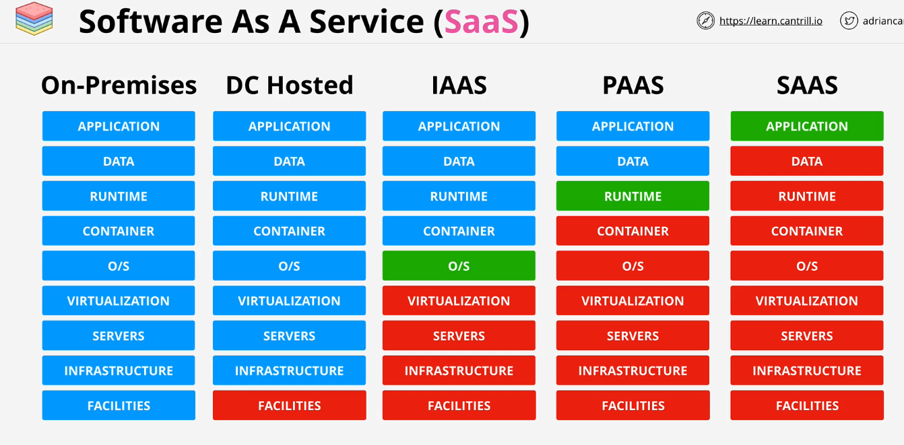

# Tech Fundamentals

## YAML

Design to serialize data in a human readable way

Is commonly used for configuration.
Supports lists & dictionaries e.g.

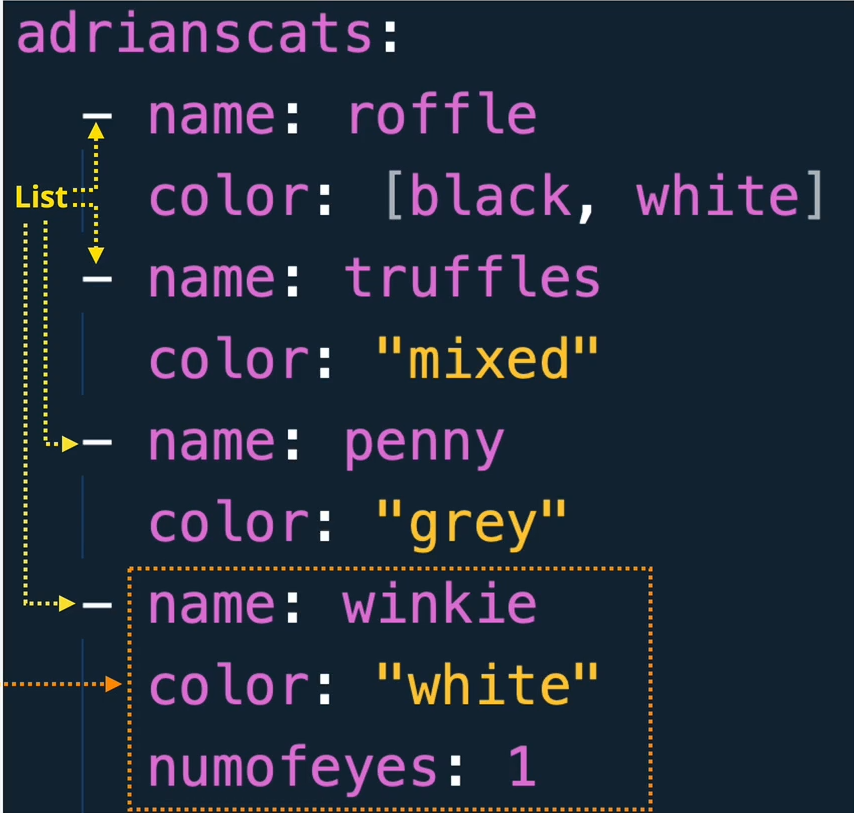

## Networking

OSI 7- Layer Model (Networking Stack)


### Layer 1 (Physical Layer)

If using a shared medium (a HUB) this HUB retransmitt everything that it receives to all of the devices connected. Including Errors and collisions

It's like shouting to a room with other people and not using any names

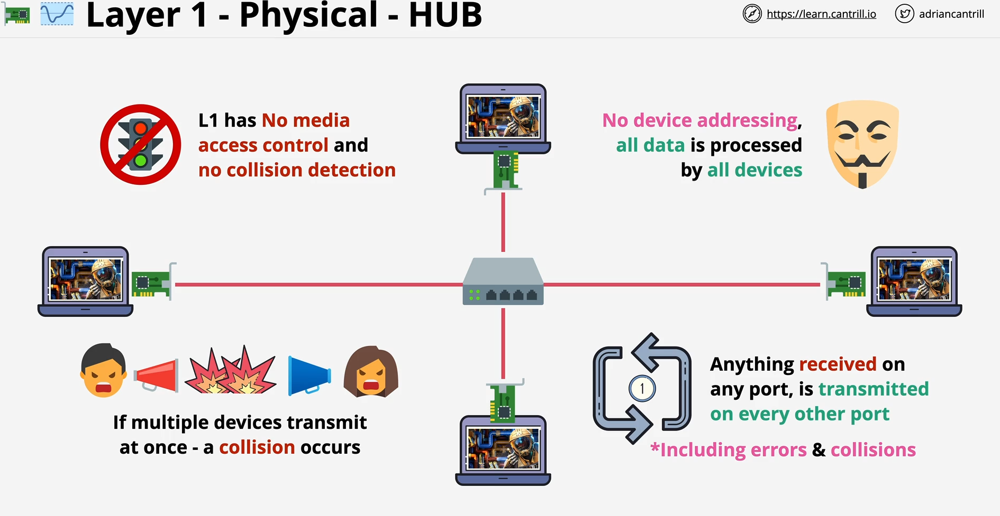


### Layer 2 (Data Link) e.g. Ethernet

It runs over layer 1

Introduces the concept of Frames (Ethernet frame), which are a format for sending information over a layer 2 network

It introduces MAC address for every device in the network, this address IS NOT software assigned, it is a unique addresses attached to a specific piece of hardware.
It is divided in two parts:

1. Organizational Unique Identifier - (OUI) this one is regarding the producer of the hardware
2. Network Interface Controller (NIC)

This two parts together is what makes the address unique.

**Frame**
It is a protocolized way of transmitting data used by layer 3. It contains information about the MAC source, MAC destination and the Ether Type (e.g. IP addresses)
It also contains the payload which is between 45-1500 bytes.

**NOTE** When there is no destination MAC address (all Fs) it is known as broadcasting.

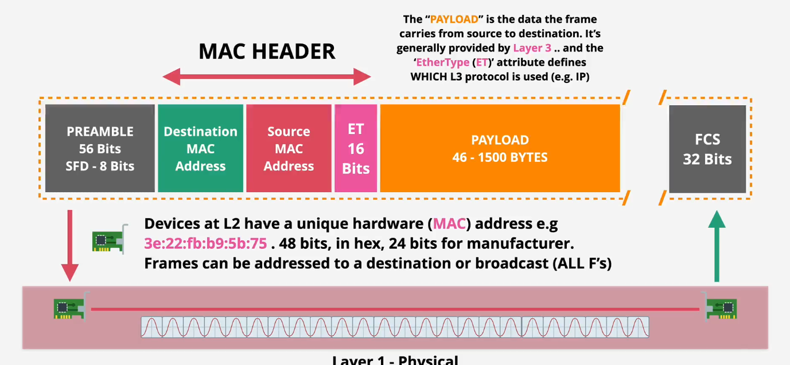

Layer 2 checks for a carrier to see if another MAC address is transmitting, if a carrier is detected it waits for it to finish, this way there is no collision of data.

Using a Switch over a HUB is better since it understands layer 2 (hast layer 2 software inside of it) (has a MAC Address table), this means that can avoid collisions


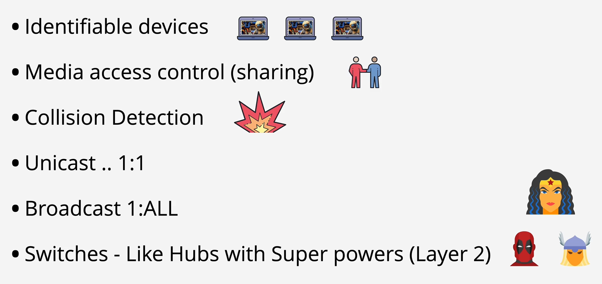

### Layer 3 - Network (IP protocol) (Routers)

The purpose of this layer is to get data from one location to another.

Data are moved in packets (similar to Frames), this contains data to be moved as well as a destination and source addresses.

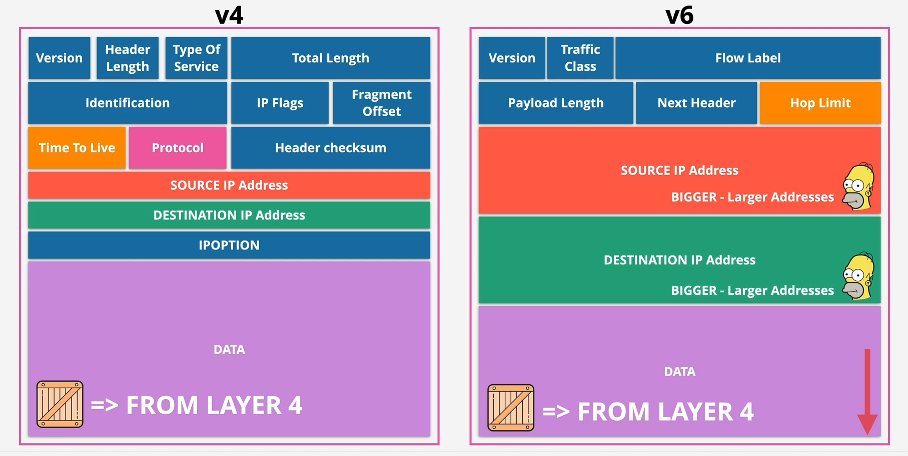

**IPv4**

AP addresses are separated into two parts the NETWORK identifier and the HOST identifier. To know if two devices are local, you just need to see if both networks are the same.

**A subnet mask is used to identify the network on an IP address**

for example a /16 submask means that the first 2 bytes of the IP is the HOST.

e.g.

133.33.3.7/16

means that the network start is

133.33.0.0

and the network end is

133.33.255.255

This is used for machines to know when they need to route packets accross different intermediate tables (different hosts) or just to your local LAN.

**Route Tables and Routes**

This table are used by Internet providers to forward your requests to the correct destination. If there are multiple matches it uses the more specifc one. /0 is the least specific /32 is the most specific (it actually is a single IPv4 address since it has all 4 bytes)

If there are no matches it uses the default destination 0.0.0.0/0

**Address Resolution Protocol (ARP)**
When you want to encapsulate an IP Packet into a Frame for a given MAC Address, but you don't know the MAC address of the gateway, that's when you use ARP, this will give you that MAC Address.

This protocol broadcasts in layer 2 asking which device has a certain IP, the device that has that IP responds to the broadcast.


### Layer 4 - Transport (maybe layer 5)

This layer helps to order IP packets.
It also helps to distinguish between applications, since layer 3 does not offer any way to distinguish between two or more connections.

IT introduces two protocols - TCP & UDP

**TCP** - Transmission Control Protocol -This is used for reliability and it is used for HTTP, HTTPS, SSH, etc.
It is a connection oriented protocol, this means you need to set up a connection between the two devices and it creates a bi-directional channel of communication.

**UDP** - User Datagram Protocol - This protocol is less realiable since it does not need the overhead of TCP, but it also has a better performance due to this.

**TCP continuation**

It uses segments which are encapsulated within IP packets.
A segement contains the SOURCE and DESTINATION PORTS. This gives us the ability to have multiple communications to a single IP e.g. TCP port 433 is HTTPS.

It also contains a SEQUENCE NUMBER, this sequence number contians the order of the packets. This way the evice knows for which segment the IP packet belongs to and also in which order it should go.

The ACKNOWLEDGMENT field is used for letting know the source that it received the package

WINDOW - this field is used for letting the source know how many bytes you can receive between acknowledgement. Once you reach that window, the source pauses until you acknowledge the packages receives. The larger the window the faster the connection since you need less headers.

CHECKSUM - this field is used for error checking and retransmission of data

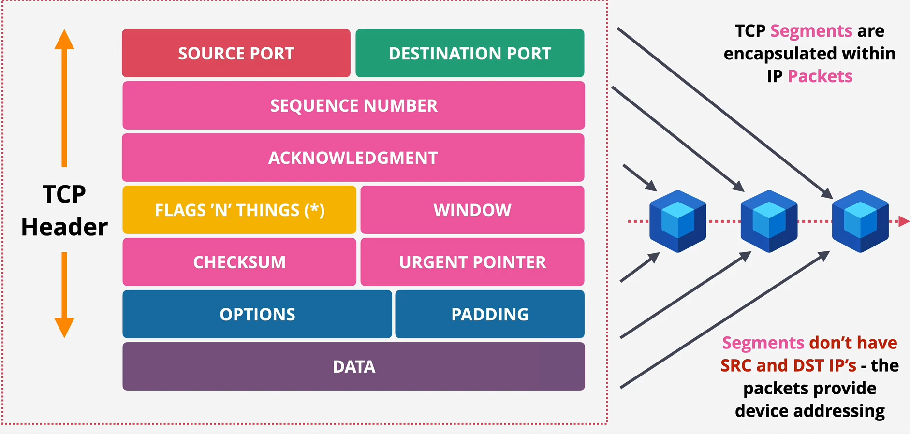

The Ephemeral port is the port of the client connecting to the server, and the well known port is the port of the server (433 for HTTPS)

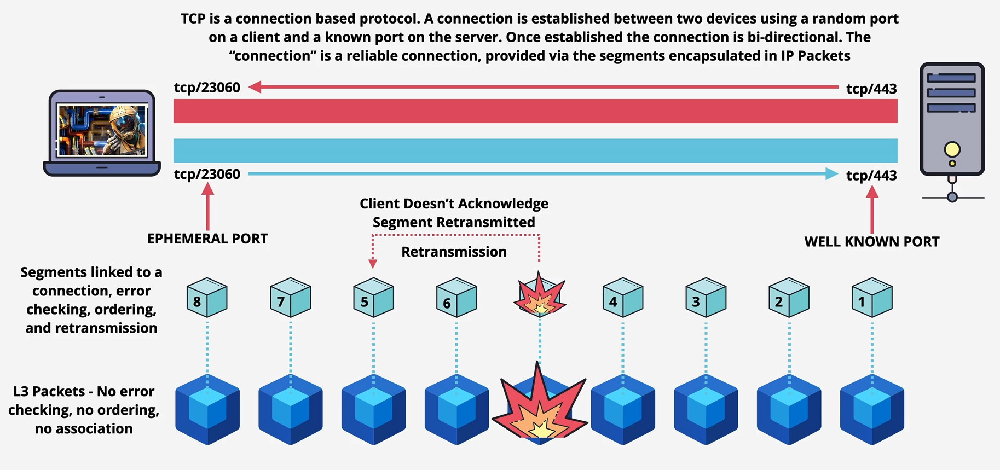

The TCP 3-way Handshake

It is used for setting up the connection

first the client needs to inform the server the sequence number. It has the SYN flag set and sends it to the server.

Now that the server knows the sequence number, it creates a segment with the flag SYN-ACK to inform the client that it received the package and also sends its own sequence number and the client sequence number + 1

(sequence number are initialized to a random number for security reasons)


**Firewalls**

Stateless Firewall - It needs both an Outbound rule and Inbound rule. This firewall in AWS is the - Network ACL -

Stateful Firewall - This understands the state of the TCP segment, so if you allow the initial connection you automatically allow the response. This in AWS is called a Security Group. (This may be considered layer 5 since it knows the session, meaning the on going communication)

### Network Address Translation (NAT)

Is designed to overcome the IPv4 shortages.

It translate private IP addresses to public IP addresses

**Static NAT** - Translate from 1 private to 1 fixed public address. This is called as an Internet Gateway in AWS (IGW)


**Dynamic NAT** - Translate 1 private to 1st available Public IP.


**Port Address Translation (PAT)** many private to 1 public (NATGW) This is used by your home internet router. This method uses ports to help identify the devices.


ALL OF THIS IS ONLY FOR IPv4 for IPv6 is not necessary since there are plenty of IPs for all devices.

### IPv4 Addressing


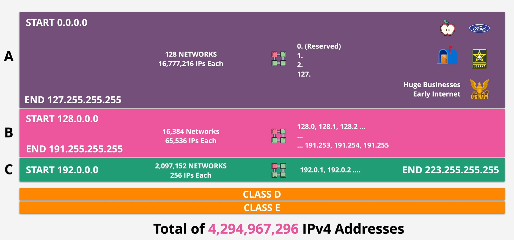

Basically Class A IPs support less networks (only 256) but waaay much more hosts, since each network has 16+ million IPs. They are were used by large companies, and all the classes that follow have the same principle (networks get bigger, but hosts get smaller since they won't probably use that much hosting)
**Private Ranges**


**IPv4 vs IPv6**


### IPv4 Subnetting

This is breaking a big network into smaller networks by using a subnet.

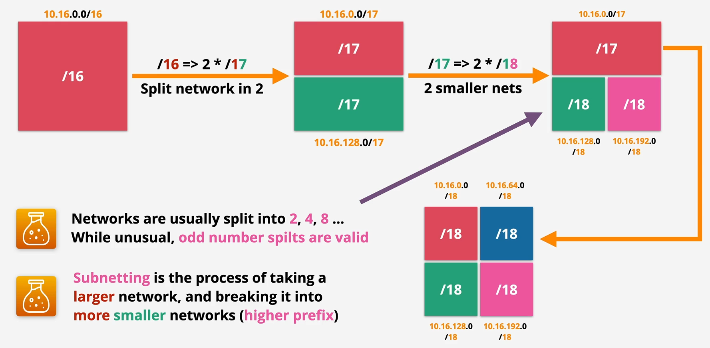

### DDoS

These attacks are used to deny the service of your applications to any user by overloading your website.

There are 3 main types of DDoS attacks:

1. Application - Uses botnets to request really expensive endpoints
2. Protocol - Uses botnets to attempt to initiate a TCP connection with your servers (3 way handshake) but they use a spoof IP so that the server response never reaches anything and it keeps waiting for a long time.
3. Volumetric - Smaller botnets, they use different DNS servers to send requests using your IP as the source addresss. This makes the DNS servers respond to your website and overloads it.

### SSL and TLS

Gives privacy anmd data integrity between client & server.

TLS - encrypts communications
Identity (server or client/server)

verified, usually the client verifies the server.

Ensures a reliable connection, protects alteration of data in transit.

TLS works as follow:

1. First the client sends a hello message containing the information about the TLS version, supported cipher suites, session ids, etc.
2. The server responds with an agreement of the cipher suite, etc. As well as its certificate published by an CA (Certificate Authority).
3. The client validates the certificate by posting to the CA for checking expiration dates, DNS, etc.
4. If the certification is valid, the client uses the server public key to encrypt a message containing the PRE-MASTER KEY.
5. The server decrypts the pre-master key using its private key and both the client and the server generate the master key, this master key is used for doing symmetric encryption.


# AWS Fundamentals

AWS services can be categorized into 2 main types

1. Public Services
2. Private Services

This public or private means to the networking only

A public service is something accessed via public endpoints e.g. S3

A private service is something accessed only via the V.P.C

Permissions control the access to a public service and networking manages the access to private service

V.P.C is proportional to your home network, it can only be accessed if you allow it and configure it.

There are 3 different network zones

1. Public internet
2. AWS private zone
3. AWS public zone

You could connect private networks directly to a private zone service, or you could use an internet GateWay to connect you private zone to the public internet.

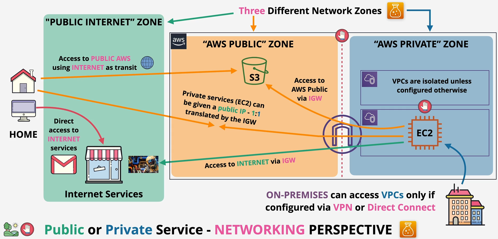

## AWS Global Infrastructure

AWS Regions

AWS Edge Locations

- Much smaller than regions
- Generally only have content distribution services
- Useful for storing data close to their customers (Netflix)

**There are 3 types of resilience for the AWS services**

1. Globally Resilient (e.g. IAM, route 53) This services can tolerate the failure of multiple regions without impacting service
2. Region Resilient (e.g. RDBS) Operate in a single Region with one set of data per region. This services replicate data to multiple availability zones in that region.

3. AZ Resilient - This services are the least resilient. If the availability zone fails the entire service fails.

## VPC (Virtual Private Cloud)

They are Regional services, meaning that they are regionally resilient

They are, by default, private and isolated unless you decide otherwise

There are two types of VPC

1. Default VPC
2. Custom VPCs

**Exam question: YOU CAN ONLY HAVE 1 DEFAULT VPC BY REGION**

But you can have as many custom VPCs in a region as you want.

Custom VPCs need to be configured 100% by the user, they are 100% private unless configured otherwise.

Default VPCs are configured by AWS (1 per region) and they are less flexible (Usually on serious deployments you always work with custom VPCs)

All of the VPCs are allocated a range of IP addresses called the VPC CIDR.

The default VPC always gets the same CIDR and can only have that CIDR which is the **172.31.0.0/16**

The default VPC ALWAYS have 1 subnet in each availability zone of the region


Default VPCs can be deleted and recreated, although some services assume that it is present so it is advised to leave them active, but not use them for any production thing realted.


## EC2

**AZ Resilient**
They are billed by the seconds it was running as well as the storage used or any commercial software that the instanced is launched with.


### Instance lyfecycle

It has different states, the main ones are:

1. Running
2. Stopped
3. Terminated

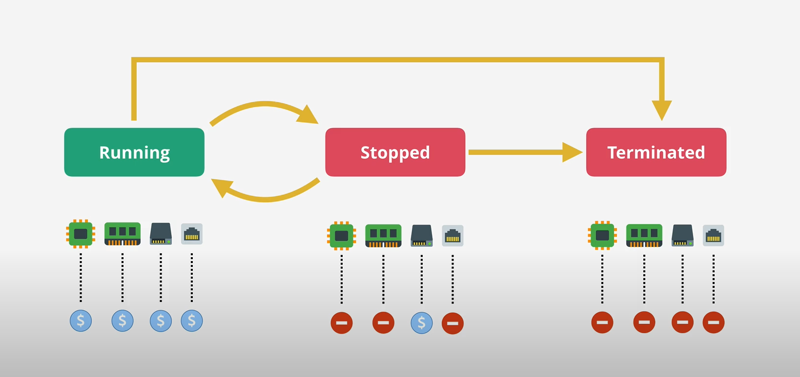

The main difference is that when an instance is stopped you are still being billed by the storage (EBS) where the instance lives, if you terminate it, you are not billed at all, but the instance is now deleted from disk and is not reversible.

### Amazon Machine Image (AMI)

Similar to a server image (ubuntu/windows), but it contains a few important things as well:

It contains attached permissions, this permissions control which accounts can and can't use the AMI.

It contains the Root Volume of the instance. This is the drive that boots the O/S

It contains a Block Device Mapping - This links any volume to the device ID of the O/S (Mapping between volumes and how the O/S sees them) (root volume, data volume, etc.)

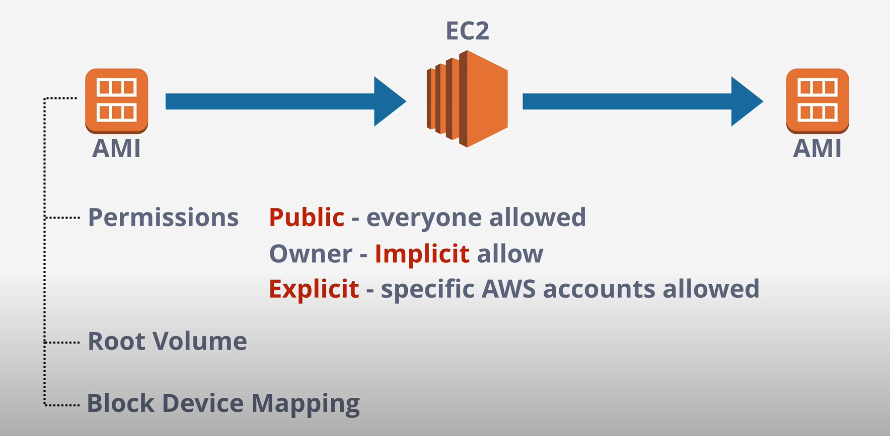

### Connecting to EC2

This EC2 can be running different O/S like Windows or Linux

For windows instances you use RDP (Remote Desktop Protocol) this runs on port 3389

For Linux instances you use SSH protocol which use port 22. You login with an SSH key pair

### S3 Basics


**S3 Objects**
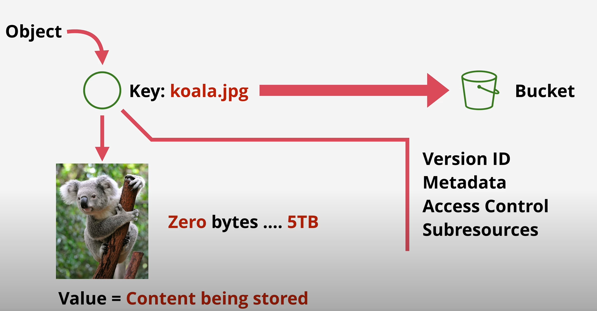

**S3 Buckets**

They are created in a specific region.

You need to configure the S3 if you want the data to leave the region.

**Exam Question: BUCKET NAMES NEED TO BE GLOBALLY UNIQUE**

S3 has a flat structure under the hood.

Folders in S3 are represented when we have object names with "/", these folder are referred to prefixes.

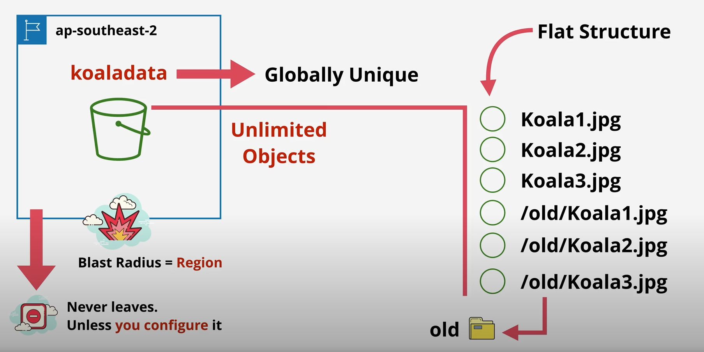

Exam Power Up:
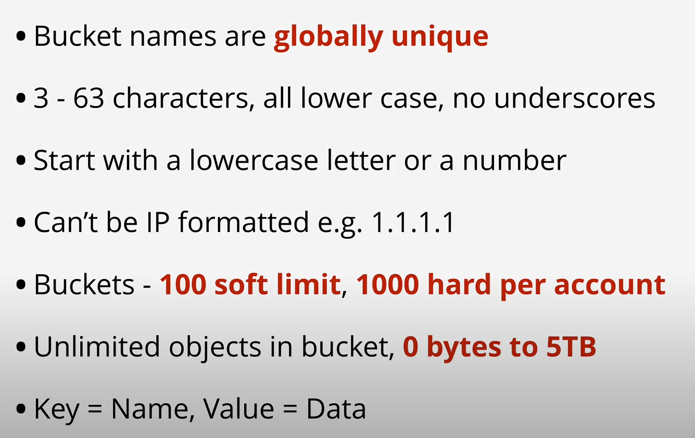

### S3 Patters and Anti patterns

S3 is an object storage system, not a file system or a block storage.

You can mount an s3 bucket into a O/S, for this you should use EBS (Elastic Block Storage). EBS only allows one thing accessing at a time, S3 does not have that limitation.

It is great for offloading data, instead of your EC2 saving it, you send it to S3

It should be your INPUT or OUTPUT to many aws services

### CloudFormation Basics

Lets you create, update or delete infrastructure in AWS in a consistent and repeteable way by using templates.

**Template Keys**

- Resources: All cloudformation always have the Resources key (it's mandatory)

- Description: You can add a Description key for specifying the author, the use case, etc.

- AWSTemplateFormatVersion: Lets you set the version of the template.

**Exam Question: If you used the key AWSTemplateFormatVersion you need to put the Description right after it.**

- Metadata: It controls how the UI is showed to the user. Generally if your template is used by a large number of users, the bigger the metadata section.

- Parameters: This prompts the user for information. You can apply default values.

- Mappings: It allows you to create lookup tables. For example If region is us-east-1 use this EC2 image, etc.

- Conditions: Allows you to create conditions, (for example if EnvType is prod) and then you can use those conditions in the Resources so that only when the condition is met a certain resource is created.

- Outputs: Are a way that once the template is finished it can return certain values as outputs (like admin password for a blog)


## Cloudwatch

Collects and manages operational data on your behalf

Some metrics are gathered naitively (default) in a product.

You can monitor external things by installing the cloudwatch agent.

It has 3 main features or products in one:

1. Cloudwatch itself (Metrics) [CPU utilization, visitis to a website, etc.]
2. Cloudwatch Logs - Anything that can be logged, it can be ingested
3. Cloudwatch Events - This events can perform other actions and can be triggered by something happening on a service or by schedule.

**Namespaces**

The namespaces are used for containing related metrics, there are default namespaces that AWS creates. e.g. AWS/EC2

**Metric**

A metric is a collection of related data points in a time ordered structure (CPU Usage, Network IN/OUT, etc.)

**Dimensions**

They are used to separate datapoints for different things within the same metric e.g. InstanceID, InstanceType, etc.

**The metris can be linked to alarm and this alarms can have an OK status, an ALARM state, which you can link an action to it (send a SNS message), or in a insufficient data state.**

## Shared Responsibility Model


## High-Availability vs Fault-Tolerance vs Disaster Recovery

**High Availability (HA)**

Maximizing a systems online time.

You can have user disruption but still be highly available. Maybe users had re-login or re run a job, but if your service was only down for a small amount of time, it is still HA.

It requires redundant servers or infrastructure as well as automation.
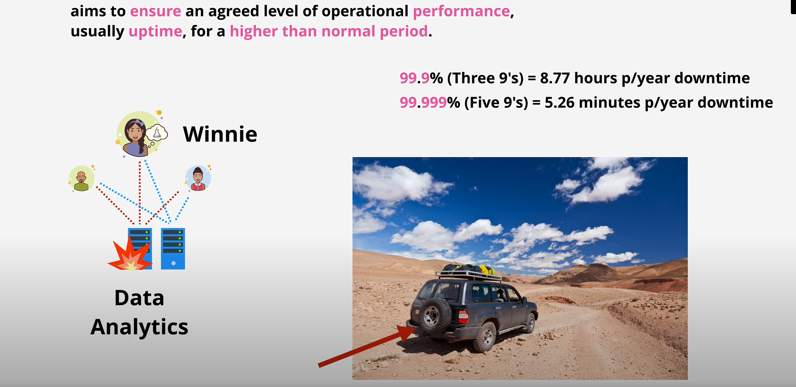

**Fault-Tolerance (FT)**

**HARDER TO DESIGN, HARDER TO IMPLEMENT AND MORE EXPENSIVE THAN HIGH AVAILABILITY.**

FT means that the system NEEDS to keep operating properly in the event of one or more failures.

You first need to minimize outage which is HA, BUT at the same time you need to design a system to tolerate a failure which means having high level of redundancy and system components able to route any traffic around a failed component.

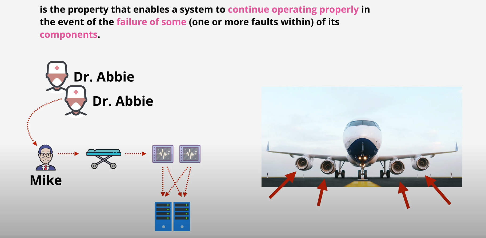

**Disaster Recovery (DR)**

Multiple stage set of processes.

A set of policies, tools and procedures to enable the recovery following a natural or human induced disaster.

Taking regular back-ups in different sites where your system are stored (off-site)

## DNS 101

Is a discovery service by translating human to machine information and vice-versa

It's a huge DB and HAS top be distributed.

It's components are:


The Resolver needs to locate the correct Nameserver for the Zone, query the Namerserver, rerieve the Zonefile and pass it to the DNSClient.

**DNS Root**

There are 13 special name servers known as the "Root Servers", these servers are operated by 12 different large companies or organizations (this servers can be a cluster of servers, but they are managed by 1 organization). Only VeriSign manages 2 of these servers.

These organizations are only responsible of hosting the servers, the actual Root Zone (the DB) is managed by an organization called, IANA.

The root needs to be a trusted entity, that's the reason why your O/S or internet provider has a Root Hints File, this file is a list of this root servers.

1. Your DNS Client (laptop) asks a DNS resolver the IP of a DNS name
2. The DNS Resolver uses the Hint File to communicate with one or more of the DNS Root servers to access the Root Zone.

Authoritative means that it is trusted to route for a specific DNS, the root zone at first is the only thing that is authoritative in DNS. This root zone delegates to another zone for a particular DNS, this zone then becomes authoritative ONLY for that part (.com, .org, etc.) since the root zone is ONLY authoritative for the top level zones (.com, .org, .net)

## Route53 Basics

1. Register Domains
2. Host Zones.. managed nameservers

It is a global service with a single database

This database is globally resilient

**Register Domains**

It has relationships with all of the major domain registries (.com, .net, etc)

How it works is:

1. First it checks if the domain is available for that top level domain.
2. Then Route53 creates a zone file for the domain being registered. (this zone file can be seen as a database that contains all the info for a particular domain)
3. Route53 allocate nameservers for the zone (4 of them), it puts the zone file in these 4 managed services
4. It add the nameserver record into the zone file for the .com/.org top level domain by using nameserver records.

**Zones**

Zone files in AWS are called hosted zones

They are hosted on four managed name servers

A hosted zone can be public (they live in the AWS public zone [internet])

A hosted zone might be private... linked to a VPC

Ahosted zone hosts DNS records.

Inside Route53 the records are called recordsets

## DNS Record Types

- Namerservers (NS) = Allow delegation to occur, you can have multiple of these pointing to the same DNS, and that means that all of those servers are the Zone for that particular domain


- A and AAAA Records = These records map a hostname to an IP, the only difference between them is that the A links to an IPv4 and the AAAA links to an IPv6 (usually you create two records with the same name, one for A and another one for AAAA)

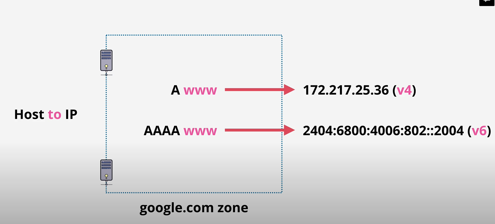

- CNAMEs = For a given zone, these records are shortcuts, they do not point to a specific IP, they reference an A record, this is used to avoid overhead (you only change one record instead of N)


- MX Records = Are used for email, they work the same as an A record but it uses the domain (whatever is after the @) to query de root servers to get into the domain Zone (e.g. @gmail.com => google.com) and then inside the zone it queries for the MX records.

- TXT Records = Allows you to add arbitrary text to a domain, one common usage is to prove domain ownership, for example adding a random phrase to prove you own the record.

**TTL (Time To Live)**

This is the amount of time the authoritative answer will be cached (The result of walking the tree which is an IP linked to a DNS). If another client asks for the same DNS before the TTL expires, they will receive the Non-Authoritative answer that was cached.

# IAM, Accounts and AWS Organizations

## IAM Identity Policies

- It is a group of statements
- Each statement grant or deny permissions to AWS Services
- A statement has 4 main keys:
  1. Sid -> The ID (optional) (Best practice is to use it)
  2. Effect -> Either "Allow" or "Deny"
  3. Action -> The action/s to be done (service:operation)(you can use wildcards)
  4. Resource -> List of the resources (can use wildcards as well) You need to use ARNs

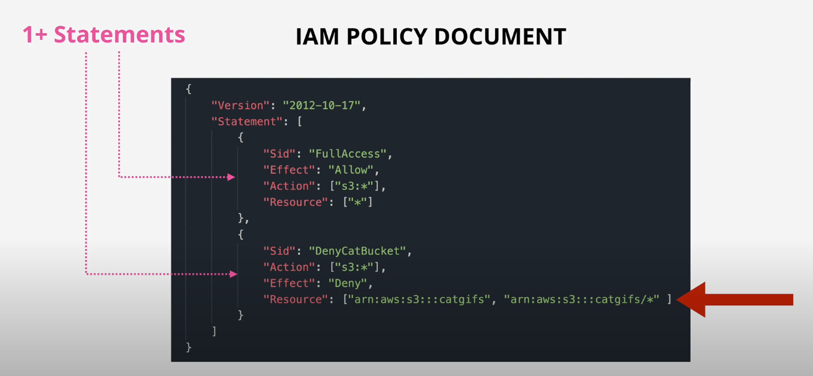

How to handle statements overlaps?

1. First AWS looks for Explicit Denies
2. Then it looks for Explicit Allows
3. If no Allow or Deny -> Defaults to Deny

Deny always take priorty over Allows

When a user tries to access a service, AWS collects all the policies from the user, groups where the user forms part of and the resource itself and evaluate them all as a bunch.


**Inline policies vs managed policies**

- An inline policy is attached directly to the identity
- Managed policies exists as their own and you attached them to identities. This helps to be more reusable and low management overhead.

Inline policies should only be used as exceptions

There are two main types of managed policies, AWS managed policies and custom made policies.

## IAM Users

IAM Users are an identity used for anything that requires long-term access to AWS.

Examples of this are humans, applications or service accounts.

Principals need to authenticate themselves via User and Password or Access keys to prove IAM their identity.

The principal then becames an authenticated identity.


Authentication is the process of proving your identity

Authorization is the process of AWS granting or denying an authenticated identity the permission to perform an action.

**ARN**

- Identifies a single resource
- They have a defined format

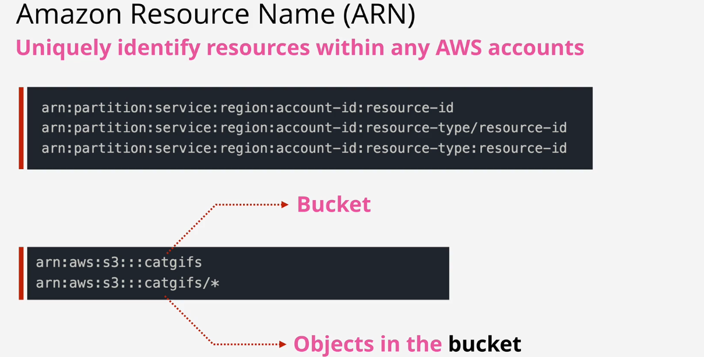

On S3 buckets you dont need a region or account ID since they are globally unique

You can use a _ for regions, usually you only need to use :: on places where you DONT need to specify, otherwise use _ to denote all of them.

The partition field is always aws unless you have in other regions, for example China

the service is the service namespace (se, iam, rds)

region one is obvious

account-id is obvious as well (some resources don't need it as well)

resource-id/resource-type can be the name of a user or an instance name

EXAM POWER UP


## IAM Groups

- This are containers for Users
- Exam Question: You CAN'T log in into a group, they have no credentials.
- They are used solely for organizing IAM Users.
- They can have Inline or Managed policies attached
- Exam Question: There isn't a group by default that contains all users although you can create one like that.
- You can't have groups within groups
- There is a soft limit of 300 groups
- Groups are NOT a true identity. They CAN'T be referenced as a principal in a policy (e.g. you cant create an inline policy in an s3 bucket to grant acess to a group, but you can do it for a user)

## IAM Roles

- Multiple Users/applications (principals)
- If you are not sure how many of these principals you are gonna have, the best way to go use is using a role
- They are usually used for a short period of time
- IAM Roles have 2 TYPES OF POLICIES
  1. Trust Policies
  2. Permissions Policy

1. Trust Policies -> Controls which identities/services/roles can and can't assume the role in the same or in other AWS accounts (even allow anonymous users or other types of identities such as Facebook, Google, etc.)

2. Permissions Policies -> These are the regular policies but how does AWS manages them for roles? = If an identity is allowed to assume the role, AWS creates temporary security credentials for the identity (they are time limited), once they expire the identity needs to renew them by REASSUMING the role.

Usually roles are used in AWS organizations to allows to log in into one account and access different accounts without having to log in again.

STS (Secure Token Service) is the service that manages the creation of the temporary credentials for roles.

**sts:AssumeRole** is the operation used for assuming the role and getting the credentials.

### When to use IAM Roles???

- AWS Lambda (Function as a Service)


- For Emergency situations (when a customer service needs to terminate an instance for example, this is referred as break glass situation)

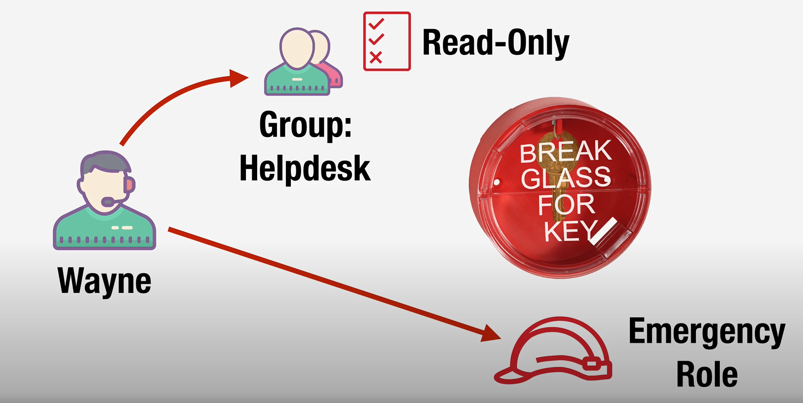

- For giving access to users that are part of other organization like Azure, and specially if they are over 5,000. This way they assume the role and get temporary keys.
  THIS IS CALLED ID FEDERATION

Exam question: When dealing with architecture for mobile apps user access (potentially millions of them) using ID Federations (IAM Roles) is the best way

## Serviced-linked roles

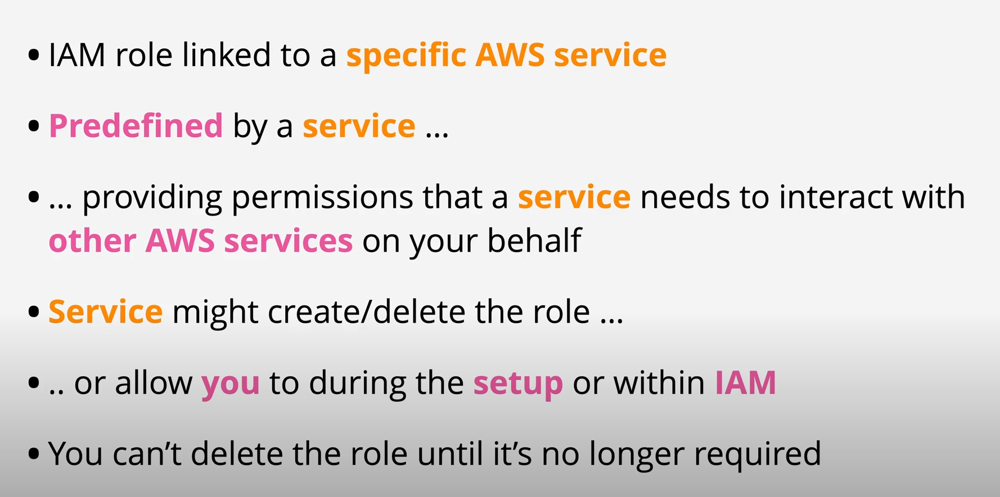

## AWS Organizations

A product that allows larger business to manage multiple AWS accounts in a cost effective way

- [Management Account] AWS Organization is created via a single AWS Account, the Management Account, this account its not within the organization, and the organization DOES NOT live inside this account.
- Using the management account you can invite other standard accounts to be part of the organization, when they decide to join the become member accounts.

Organizations have two types of "containers" the Root and the Unit.

The root stands at the top and can be one or more member accounts (or the management account), it can also contain other containers (Orgniazational Units [OU])


**Consolidated Billing**

Individual billing methods are removed from the member accounts, and now they pass that billing to the management account (payer account)


- You can also create new accounts within organizations (directly in the organization), this way the account does not need be invited and then accept the invitation

BEST PRACTICES:

The best practices with organizations is to have a single account that handles all the IAM identities, this could be the management account or another account. You can also configure in this IAM account, using ID Federation, to use your own internal log in system for logging into AWS.

**When you add an existing account to be part of the organization you need to MANUALLY CREATE the "OrganizationAccountAccessRole"**

If the account was created directly via the management account, this role will be created for you by default.

## Service Control Policies

They are used for delimiting the access that accounts have within an organization, e.g. Just delimit to a certain region (us-east-1), only allows a certain size of EC2 instance, etc.

- These policies are attached to the organization as a whole (to the root container), or one ore more Organizational Unit or even a specific AWS account.
- They inherit down the organization tree, this means that policies in the root are applied to all the accounts in the organization, etc.
- The management account is NEVER affected with service control policies, that is the reason why resources should not be in that account.
- These policies are account permissions boundaries, they limit what the account can do (Even the account root user).

These policies are called either Allow or Deny List

- By default AWS provides a FullAWSAccess which is an Allow list that allows everything.
- Any restrictions needs to be added by you.

At the end in an organization a user has the permissions that both the SCP and the Identity policies grants.


## Cloudwatch Logs

For creating logs, it can be either an AWS service that uses cloudwatch directly or by using the agent inside an application.

You can create metrics that trigger alarms using logs


Log streams -> Ordered set of log events for a specific source for a specific thing

Log groups -> Containers for multiple log streams for the same type of logging.

You store configuration settings at the log group level (retention, etc.)

You also define metric filters at the log group level.

Metric filters increment a metric which can be linked to alarms.

## CloudTrail Essentials

- Logs API calls/activities as a CloudTrail Event
- A CloudTrail Event is any activity taken by a user or role or service in the account.
- Stores by default the last 90 days of history (no cost)
- If you want to customize with more days, you need to create 1 or more Trails
- Events can be of 2 kinds:

  1. Management Events -> e.g. Creating/terminating an EC2 instance
  2. Data Events -> e.g. Objects being uploaded or accessed from S3

- **By default cloud trails only stores management events, since data events have higher volume.**

- A "Trail" is the unit of config inside inside cloudtrail
- A "Trail" logs events for the region is configurated
- You can also create trails for all regions
- **GLOBAL SERVICES LOG TO us-east-1** e.g. IAM
- The logs can be stored in an s3 bucket, and that way they can be stored indefinitely
- You can also store the cloudtrail logs into cloudwatch logs.
- You can now create organizational trails (stores logs for all accounts)

**NOT REALTIME** It takes around 15 mins

EXAM POWER UP:


**Charges in cloudtrail:**

- The 90 daya default is free
- You can have 1 copy of management free in every region (1 trail) in each account
- Any additional trails are charged at 2dls per 100k events.
- When logging data events comes with a charge regardless of the number, 10 cents per 100k events.

# S3

## S3 Security

- S3 is private by default
- The only identity that has access to a bucket by default is the account root user
- By using resource policy you can give access to multiple users in different accounts.
- Using resource policies can allow or deny anonymous principals as well.

**Access Control Lists (ACLs) LEGACY [recommended to use bucket policies instead]**

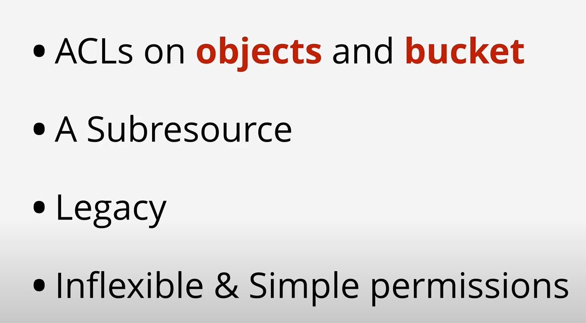

**Block Public Access**

This is a setting used for blocking any public access to the bucket NO MATTER what the policies says. It can be either for ACLs or policies either new or existing ones as well

Exam Power UP:


## S3 Static Website Hosting

- This feature allows acces via HTTP.
- Index and Error documents are set.
- When you enable this feature in a bucket, AWS creates a website endpoint (it is automatically generated)

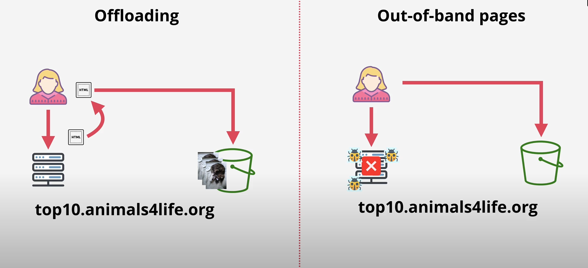

## Object Versioning

- It starts as disabled, BUT once its enabled you CAN'T GO BACK to disabled, you can move it back to suspended and back to enabled
- Basically object versioning assign an ID to the objects, this way you can have multiple objects with the same name but with different IDs
- When deleting AWS puts a delete marker which hides the other versions, this way you can undelete and AWS only unhides the objects by eliminating the marker.
- You can also delete an actual object by specifying the version

## MFA Delete

- Enabled in versioning config
- MFA is required to change bucket versioning state
- MFA is required to delete versions
- You will need to provide both the serial number of your MFA + Code that it generates

## S3 Performance Optimization

- By default objects are uploaded as a single data stream to s3
- The problem is that if an upload fails, this means that the entire stream fails (requires full restart)
- Speed & reliability = limit of 1 stream

The solution for this is using multipart upload

**Multipart Upload**

- Data is now broken up into chunks (minimum size is 100MB)
- Never use single stream for objects above 100MB in size, it's really unreliable
- An upload can be split into a max of 10,000 parts, each part can range in size between 5MB and 5GB
- Parts can fail, AND be RESTARTED in isolation
- By doing this the risk is reduced and at the same time it improves the transfer rate.

**S3 Accelerated Transfer**

- By default data uploaded to an S3 bucket uses the public internet for routing it to the destination, this can cause overhead since the route taken by the DNS resolver might not be the most optimal one.

- This feature allows our data to have optimized routing paths by using AWS Edge locations as a connection point, and then it will use the most direct path to the router where our S3 bucket is located.

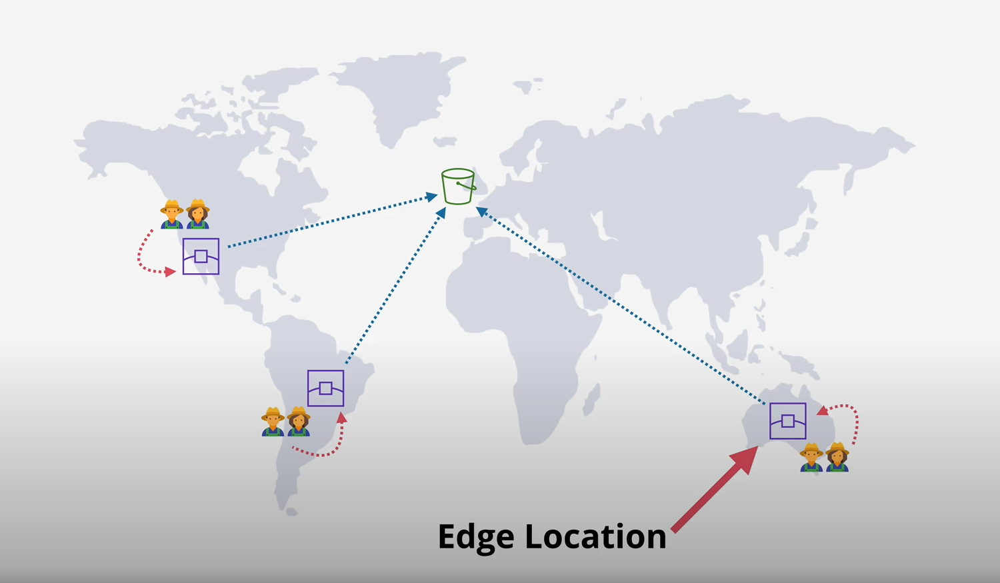

## Encryption 101

**Encryption Approaches**


**Signing**

How do you know that the message received was actually encrypted by the real client?

In theory anyone can have access to the public key(the one that encrypts).

The answer is by signing a message. This is done by encrypting with the PRIVATE key instead of the public, and sending that message to the other party, then the other party using the PUBLIC key it decripts the message and knows that the sender actually has the private key. (Identity proved)

**Steganography**

Steganography is the technique of hiding secret data within an ordinary, non-secret, file or message in order to avoid detection; the secret data is then extracted at its destination.

## Key Management Servce (KMS)

- Is a regional and a public service
- Lets you create, store and manage keys
- Handles symmetric and asymmetric ketys
- Cryptographic operations (encrypt, decrypt)
- Exam question: **KEYS NEVER LEAVE KMS it has a FIPS 140-2 standard (security standard)**

**Customer Master Keys (CMK)**

- They are stored isolated to a region & never leave neither the region nor the AWS netowork (you cant ask for it)
- There are:
  1. AWS managed CMKs -> Generatd automagically by AWS when using a service that needs KMS
  2. Customer managed CMKs -> Created explicitly by the customer (they are more flexible)
- It is logical (kind of a container) - contains ID, date, policy, desc & state
- It is backed by physical key material
- Generated or Imported
- Exam question: CMKs can be used for up to 4KM of data
- CMKs support rotation (managed keys rotate by default every 3 years and customer keys by default do not rotate)
- You can create aliases so that applications uses these aliases and then if you need to change the underlying CMK, you just change the pointer of the alias. (they are per region as well)

KMS ALWAYS encrypts the CMKs before storing them in disk.

For decrypting operations KMS does not need to know which CMK to use, that information is encoded into the cyphertext of the data.

**Data Encryption Keys (DEKs)**

These keys are another type of keys generated by a CMKs and are used to encrypt data > 4KB

Exam question: KMS DOES NOT STORE the Data Encryption Keys, the reason why is because KMS does not encrypt the data with this key, YOU need to do it, or the service using it.

How does this work?

1. KMS generates a DEK and returns to you the plaintext version and the cypthertext version (encryptes using a DEK)
2. You or the service using the key, encrypts the data with the plaintext key and AFTER that DISCARDs the plaintext key.
3. You store side by side the encrypted data and the encrypted key
4. Whenever you want to decrypt the data you ask KMS for the plaintext key by giving as input the cypher key and KMS returns again the plaintext key

**S3 uses these DEKs for encrypting the data, and KMS acts as the key manager**

**Key policies**

- Is a type of resource policy.
- Every CMK has one.
- You need to tell the CMK to trust the account.

**Encryption in S3**

- Buckets ARE NOT encrypted, OBJECTS are encrypted
- By default S3 ALWAYS has encrpytion in transit
- For encryption AT REST there are 2 possible alternatives:
  1. Client-Side Encryption -> Data is encrypted by the client (AWS never sees the actual data)
  2. Server-Side Encryption -> Data is encrypted by S3.

There are 3 types of Server Side Encryption:
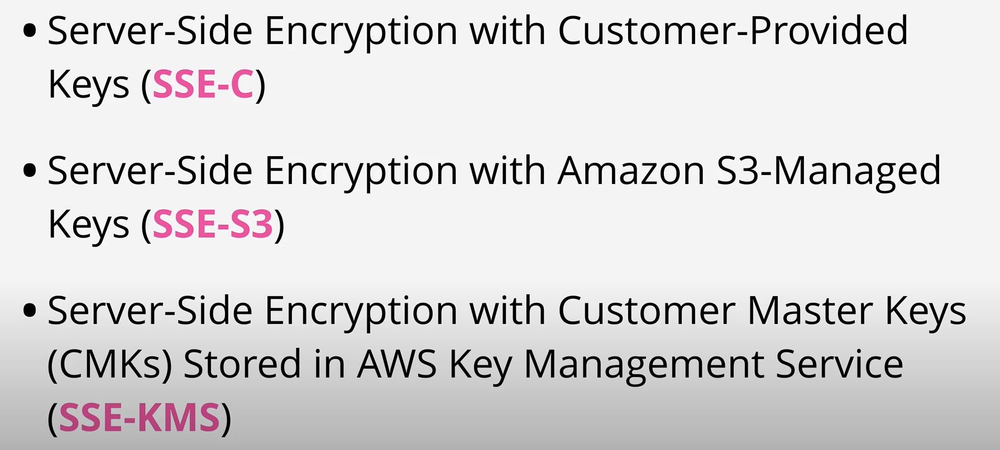

**SSE-C**

The client manages the keys, you need to provide the key for each object, S3 then encrypts the data using the key as well as a hash of the key, this way when you ask to decrypt the data S3 checks if the hash of the key you provide matches the hash that was stored (a security measure) and if it does, it decrypts and returns the data (S3 always discard the keys you send after doing the hash)

**SSE-S3**

**Exam question: AWS uses AES-256 Encryption algorithm!!!**

AWS handles the encrypt, decrypt and manages the keys as well

It works this way:

1. AWS creates a master key
2. AWS creates a new key for EACH object, and uses that key to encrypt the object
3. AWS encrypts the object key with the master key and discards the plaintext key
4. It stores the objects and the cypherkey
5. When someone asks for the data, it uses the master key to regenerate the object plaintext key and using this key it decrypts the object.

It presents 3 significant problems when you are in a regulatory environment:

1. You cant control the keys and access that are used
2. You cant control the rotations of the keys
3. You DO NOT have role separation -> Any Full S3 admin can decrypt and view data. In some environments you may want to have different roles, like someone with access to the data but not to decrypted data.

**SSE-KMS**

This method creates a CMK for the S3 master key, this way you can specify the roles on the key and even if someone has full access to S3, if he or she does not have permissions for decrypting the data (on the key) then they would not be able to do so.

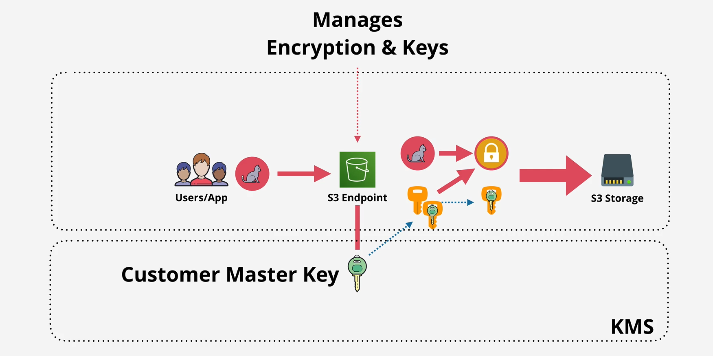


Finally, you need to specify in the headers of the request the type of encryption (AES256 for SSE-S3 and aws:kms for SSE-KMS), but you can specify a default.

### S3 storeage Classes

1. S3 Standard -> It stores the object on 3 AZ

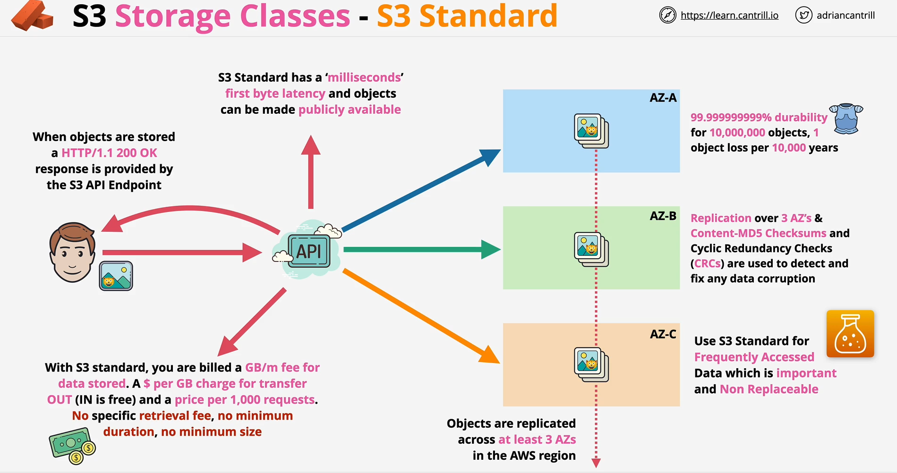

2. S3 Standard-IA (Infrequently Access) -> Shares most of the characteristics of S3 Standard BUT storage cost are much cheaper, BUT it has a RETRIEVAL fee. It has a minimum duration charge of 30 days.

It should only be used for data that is not being accessed but needs to be stored, and even better if they are big chunks of data.

3. S3 One Zone-IA -> Same as S3 Standard-IA but it is only stored in 1 AZ.

It should be used for data infrequently accessed and is non critical or easily replaced.

4. S3 Glacier - Instant -> Like S3 Standard-IA ... cheaper storage, more expensive retrieval, longer minimums

5. S3 Glacier - Flexible (Used to be S3 Glacier) -> This takes time to retrieve the data (from minutes to hours), it should be used only for archival data where you might only access it every year or so.


6. S3 Glacier Deep Archive -> Less expensive, but more restrictions. (Takes longer to get the data and has a 40kb minimum and a 180 day minimum duration). It should only be used for data that rarely if ever needs to be accessed.

7. S3 Intelligent-Tiering -> It monitors your objects and moves them around the S3 classes depending on how many days since the last time someone retrieved that object. You can choose to also allow it to move them to Glacier Flexible and Deep (where there are delay) or you can choose to not use them and the retrieval will always be inmediate.

It has a management fee -> It is designed for long-lived data with changing or unknow patterns.

### S3 Lifecycle Configuration

- Set of rules that are applied to a bucket
- These rules can apply to the entire bucket or to group of objects inside the bucket
- Actions can be:
  1. transition actions -> Changes storage class of objects
  2. Expiration Actions -> Deletes objects
- These rules ARE NOT based on access, that is done via intelligent tiering

Transition only happens in a downward direction,

Be careful to transition small objects since they might even cost more.

There is a minimum of 30 days in standard before transition.


## S3 Replication

There are 2 types:

1. Cross-Region Replication
2. Same-Region Replication

The replication config is applied from the source bucket, you need to configure the destination bucket as well as the role needed.

If configuring replication to a different account, you need to add a bucket policy to the destination bucket.

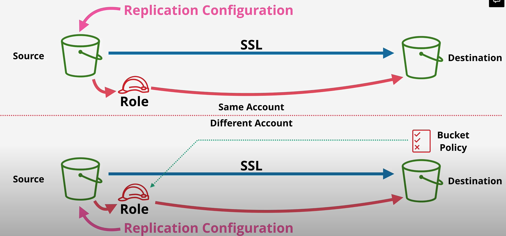

**S3 Replication Options**

- The default is all objects (all prefixes and all tags)
- You can also create a rule as a filter (for pre-fix, tags, etc.)
- You can also pick the storage class to use.
- You can also override the ownership so that it points now to the destination account

**Exam questions!!!:**

- Replication Time Control (RTC) -> Is used to mantain sync within 15 mins window.

- Replication is not retroactive & versioning needs to be ON (Not retroactive means that objects that were already in the bucket ARE NOT gonna be replicated.)

- One way replication Source to Destination only

- You can replicate unencrypted, SSE-S3, SSE-KMS (With extra config) NOT capable of replicating SSE-C!

- Source bucket owner needs permissions to the objects.

- NO replication on system events (lifecycle management)

- CANT replicate objects that are Glacier or Glacier Deep Archive (they are cold)

- NO DELETES are replicated

Why use replication?????

- SRR - Log Aggregation (using tags or indexes)
- SRR - PROD and TEST Sync
- SRR - Resilience with strict sovereignty
- CRR - Global Resilience Improvements
- CRR - Latency Reduction

### S3 Presigned URLs

This is usually used for giving access to private S3 buckets to users thata are signed in into a private application. This way you only need an IAM User logged in in the application, when the application user asks for a video or photo, the applications asks for a presigned URL with an expiration of 2 hours or so and returns that link to the user. That way the S3 bucket keeps being private and you dont need to give access to some credentials to the user, neither download the video (can be seen through the web)

- It is a way to configure a URL for accessing specific objects in an S3 object that is not Public
- The URL has an expiration date
- The person that uses the presigned URL has the same permissions that the person that created the URL for that specific object
- DO NOT create presigned URLs using a Role (only an Identity) this is due to expiring credentials of the Role and that makes the URL invalid.


Exam PowerUp!

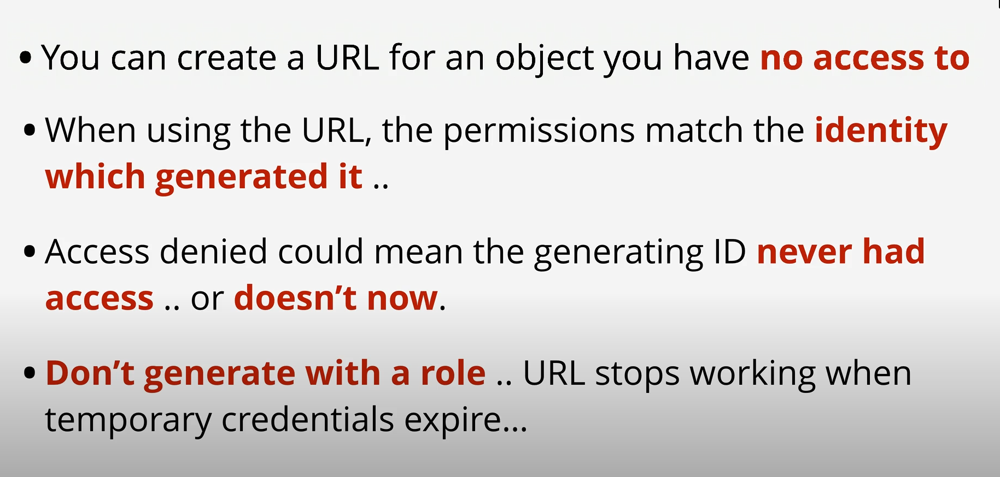

## S3 Select and Glacier Select

- Using a SQL like statement to select part of an object.
- You can use this with JSON, CSV, Parquet, etc.

By doing this you filter the data in S3 instead of your app and this helps on speed and cost.

## S3 Events

- Is kind of legacy since you can use Event Bridge to do the same
- Lets you confiugre events based on Uploads, Deletions, etc. in a bucket, and send some message to either SNS, SQS or Lambda.

## S3 Access Logs

- You need to enable logging in the bucket.
- You have a source bucket and a target bucket.
- The target bucket is the one storing the logs from the source bucket
- You need to manage the movement or deletion of the logs by yourself.

# VPC

## VPC Sizing and Structure

- You need to consider other networks IP subnets and choose an IP range that does not overlap with those networks
- Adrian recommends 10.x.y.z range where you can avoid the first 10.0 and 10.1 and choose 10.16.0.0/17 as the submask.
- Reserve at least 2 network ranges per region being used per account.
- In the Animals4Life scenario, we need 5 regions (3 on the US, 1 Europe and 1 Australia), and we need 4 Accounts, that gives us a total of 5 x 2 x 4 (the 5 are the number of regions, the 2 are the networks needed per region and the 4 is the total number of Accounts [dev, stage, prod, demo?]) This gives us an ideal number of 40 ranges to use, with the 10.16.0.0/17 is more than enough.

## VPC sizing


- Usually a good starting point is having 3 AZ and a spare one for the future.

- For each one of this netoworks usually you will have 3 tiers, WEB, APP and DB but it is also good practice to consider one more as the spare one (4 subnets)

- Each tier has its own subnet FOR EACH AVAILABILITY ZONE, this means that we will end up having 4 WEB subnets, 4 APP subnets, etc.

When you know the number of subnets needed then you just need to define how big your VPC needs to be based on the amount of IPs you will need for each subnet.

If you choose a VPC of size /16 then you know each subnet will have a /20 mask, if you choose a VPC of size /17 each subnet will have /21 and so on so forth.


## How to build your VPC

End Result will be:
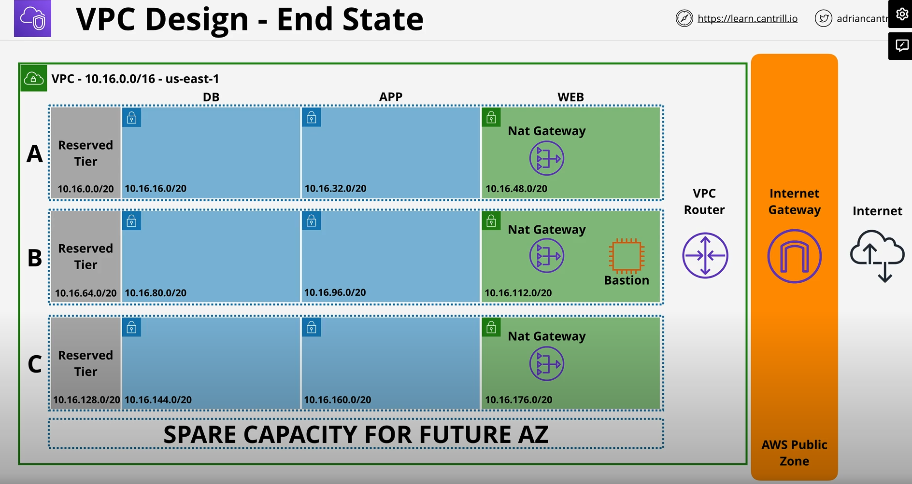

- Each VPC has at least 1 private CIDR block and this block ranges from a /16 (65,536 IPs) to a /28 (16 IPs)

- There is a maximum of 5 VPCs per account.
- Optional single assigned IPv6 /56 CIDR Block
- VPC have fully featured DNS provided by Route 53
- VPC DNS is Base IP + 2 Address
- Exam Questions:
  1. enableDnsHostnames -> A setting for giving DNS Names to instances with public IP addresses in the VPC.
  2. enableDnsSupport -> Indicates whether DNS resolution is enabled or disabled in the VPC, if its enabled then instances in the VPC can use the VPC address.

## VPC Subnets

- They are where your services run from inside VPCs
- In AWS diagrams BLUE MEANS PRIVATE SUBNETS and GREEN MEANS PUBLIC SUBNETS

- Subnets are AZ Resilient
- A Subnet can't be in more than 1 AZ!
- IPv4 CIDR is a subset of the VPC CIDR
- Cannot overlap with other subnets
- Can optional have an IPv6 CIDR
- Subents can communicate freely with other subnets in the VPC
- THERE ARE 5 IP addresses that are reserved in every subnet
  1. Network Address (the first address)
  2. Network + 1 (VPC Router)
  3. Network + 2 (Reserved DNS)
  4. Network + 3 (Reserved Future Use)
  5. Last IP Address (Broadcast)

A VPC has a configuration object applied to it called DHCP (Dynamic Host Configration Protocol) and is how computing devices receive IP addresses automatically.

    This configration flows to subnets

At subnet level:

- You can also use auto assign public IPv4 (for making subnets publics)
- Auto Assign IPv6

## VPC Routing and Internet Gateway

**VPC Routing**

- Every VPC has a VPC Router - Highly available (by default it only routes traffice between subnets in the VPC)
- In every subnet netowrk + 1 address is the one used.
- This is controlled with "route tables" (each subnet has one and ONE ONLY)
- A VPC has a Main route table (This is the default for subnets)
- Route tables always give higher prefix higher priority (/32 match has more priority than a /16)
- The route tables ALWAYS have local routes which matches the CIDR block of the VPC (for both IPv4 and IPv6), local routes always have priority over public routes.

**Internet Gateway (IGW)**

- Exam Question: Region Resilient (covers all AZ in a region) gateway attached to a VPC
- A VPC can have either 0 or 1 IGW
- An IGW can have no VPC attached or be attached to ONLY 1 VPC
- Gateways the traffice between the VPC and the Internt or AWS public Zone (S3..SQS...etc)
- Managed by AWS

**How to make a subnet public:**


**IPv4 Addresses with a IGW**

- Exam question: The EC2 instances (or any service) that has a public IPv4 associated DOES NOT KNOW PUBLIC IP AT THE O/S LEVEL.
- The IGW receives the packet sent by the service and checks if it has a IPv4 associated and changes the packet source IP to that one. And when the packets come back from the source, it changes the source public IP to the internal network IP
- For IPv6 the O/S or service does have the public IP and the IGW does not do any translation. It just routes traffic

**Bastion Host or Jumpbox**

- An instance in a public subnet
- Incoming management connections arrive there
- Then access internal VPC resources
- Often is the only way IN to a VPC

## Stateful vs Stateless Firewalls

- Statless firewalls dont't know anything about the state of the request, this means having to create inbound and outbound rules.
- Stateful firewalls know the state of the requests, this is because it identifies the request and response components of a connections as being related. REDUCES ADMING OVERHEAD

## Netowrk Access Control Lists (NACL)

- Every subnet has a NACL associated
- This filter data incoming and outgoing
- Connections between the subnet is not affected by NACLs
- It always has inbound and outbound rules (stateless)
- They are stateless
- Rules are processed in order (whatever comes first is applied)
- They can explicitly deny access which makes them a good security feature for denying access to certain IPs
- They only work with IPs and Ports, can't be configured using logical resources.
- Can only be assigned to subnets, not to AWS resources.
- THEY ARE USUALLY USED ALONG SIDE SECURITY GROUPS TO ADD EXPLICIT DENY to BAD IPs/Nets

## Security Groups (SG)

- They are STATEFUL - detect response automatically
- They CAN'T do implicit denies, you need NACLs for this
- They do accept IPs/ports and logical resources
- They are not attached to instances nor subnets, they are attached to ENIs (Network Interfaces)

- You can use logical resource reference to access other resources by using their security group ( e.g. create an inbound rule in the backend app SG for allowing any connection from any resource that has the security group of web server attached, this way you do not need specific IPs) You can use self reference so that any other resource that has the same SG can access the subnet (e.g. having multiple backend apps in different subnets but sharing the same SG).

## NAT and NAT Gateways

Exam question: NAT Gateways are not region resilient they are AZ resilient, IGW is indeed region resilient.

- Network Address Transaltion (NAT) -> Changing source IP address and destination address for routing packets
- IP masquerading - hiding CIDR blocks behind one IP
- Gives Private CIDR range OUTGOING internet access (can't be used for incoming, although it does accept responses from the outgoing requests.)
- This is used because IPv4 addresses are running out
- Usually used for allowing private subnets to do updates/OS patches/external database connections/etc.
- It basically has a table containing the private IPs of the instances and the requests they made and it acts as the middle man between the IGW and the private instances (routes table from the private instances to the IGW and then does the inverse with the responses, routing them from the IGW to the private instances)
- Many to one translations
- NAT Gateways runs from a PUBLIC SUBNET, since it needs a public IP associated
- It uses Elastic IPs (Static IPv4 Public)
- AZ resilient Service
- For replicating IGW resilient you need to create one per AZ
- It has two charging elements, one that is per hour and another that is per data volume

Exam question: EC2 can be used as a NAT instance (AWS recommends using NAT Gateway instead), by default EC2 drops any data in the netowrk card when that network is not either the source or the destination of a request. If you ever need an EC2 instance to function as a NAT instance you need to disable the setting called "Source/Destination Checks".

You should only use NAT instances over NAT gateways if you are in a budget. This is because NAT Gateways scale depending on your traffic, so the cost is not deterministic.

Another pro of NAT instances is that you can connect to the instance and also use if for other purposes. NAT Gateways cant be connected to the O/S

Exam Question: NAT Gateways ONLY SUPPORT NACLs (can't have a security group), NAT instanes can have security groups.

NAT Gateways do not work with IPv6, IPv6 does not need NAT at all. As long as you add to your route table the route: "::/0 -> IGW" that will give any instance in the subnet that have IPv6 bi-directional connectivity

# EC2

**Resiliency: AZ**

## Virtualization

Servers have an O/S (e.g. Linux, Windows).
The kernel is the the only part of the O/S that runs with Privileged Mode, all the other applications in the O/S run with User Mode (can't directly interact with the hardware, needs to make a system call)

Virtualization makes possible for a single piece of hardware to run multiple O/S. Each O/S is separate

- The problem that arises with this is that the O/S from the Virtual Machines were expecting all to have privileged mode, but since they were running on the same hardware, that could not be possible (the hardware only knew about the host O/S)

- This issue can be solved with "Emulated Virtualization" by using a hypervisor. A hypervisor is a piece of software that runs in the host O/S and acts as the middle man, this hypervisor creates fake resources that the VM O/S thinks are real. By using binary translation in software, the hypervisor intercepts any sys calls that the VMs are trying to make and translate those sys calls for the host O/S, the problem with this type of virtualization is that it is really slow, since it is doing in on the fly using software.

- Para Virtualization solves this slow issue. This is done by modifying the VMs O/S to make "hypercalls" instead of sys calls. This way you can get rid of binary transaltion.

- There was still some processes made by software to trick the O/S that nothing has changed since the hardware itself was not aware of virtualization. This was solved when the physical hardware was aware of virtualization, and this is called "Hardware Assisted Virtualization"

- With HAV the CPU traps this hypercalls itself and then sends them to the hypervisor. This method helps a lot BUT the I/O operations where still really slow since there was only 1 network card for all the VMs and there was some level of software getting in the way (for this type of operations it really affects having software on top). This was solved with SR-IOV (Single Root -I/O Virtualization) this basically when hardware devices themselves (like network cards) become virtual aware. This way the network card creates "mini network cards" inside of it and lets the VMs use this mini cards, this way software is no longer needed to handle the process.

### EC2 Architecture


Inside each AZ there is an EC2 Host (these EC2 Host runs on a single AZ).

EC2 Hosts have local hardware BUT also have some local storeage called "Instance Store" this store is temporary, if the instance moves from a particular host to another one, the local storage is lost.

The host also has 2 types of networking:

1. Storage networking
2. Data networking

When instances are provisioned in a specific subnet within a VPC, what happens is that a Primary Elastic Network Interface is provisioned in the SUBNET which maps to the physical hardware of the host.

- Instances can have different network interfaces even in different subnets as long as the are all in the same AZ

- EC2 can make use of remote storage by using EBS (Elastic Block Store) EBS ALSO RUNS IN A SPECIFIC AZ.

- EBS lets you allocate volumes (storage) to instances IN THE SAME AZ.

There are just 2 ways where an instance may change of host (another host in the same AZ):

1. AWS takes a server down for maintainance
2. You stop an instance and then start it again (restarting it directly won't change the host, needs to be stopped and started)

- Usually instances of the same type runs on the same host

**What's EC2 Good for?**

- Traditional OS+Application Compute.
- Long-Running Compute (even years)
- Server style applications (Traditional applications waiting for incoming connections)
- Applications or services that need burst or steady-state loads.
- Monolithics application stacks
- Disaster Recovery environment

In general EC2 tends to be the default requirement (first option)

**As a rule of thumb, always pick EC2 at first and then just move away if you have some specific requirement**

## EC2 Instances Types

Things influenced by the resource type:

1. Resource Ratios (RAM, CPU, etc.Local storage & type of storage)
2. Storage and Data Network Bandwidth
3. System Architecture/Vendor (ARM vs x86)
4. Additional Features and Capabilties (GPUs)

There are 5 main categories:

1. **General Purposes** - Should be your default (even ratios on resources)
2. **Compute Optimized** - Media processing, High performance Computing, Scientific Modelling, gaming, ML
3. **Memory Optimized** - Processing large in-memory datasets, some database workloads.
4. **Accelerated Computing** - (niche) Hardware GPU, field programmble gate arrays (FPGAs)
5. **Storage Optimized** - Sequential and Random IO - scale-out transactional databases, data warehousing, Elasticsearch, analytics workloads.

### Decoding EC2 Types

R5dn.8xlarge -> Example of an instance type
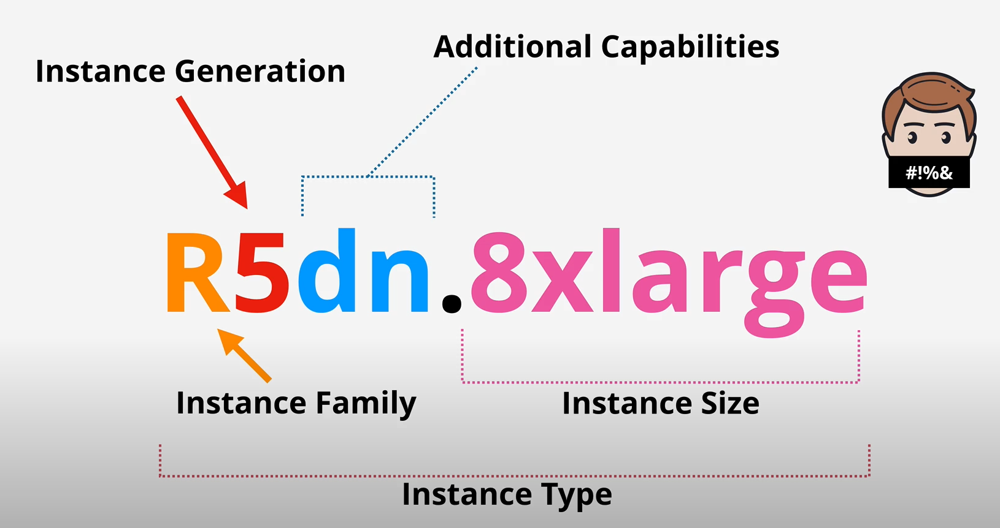
** M Family is more expensive, but they are better for applications with steady load, they also have a better bandwith with EBS compared to T family, T family is a good fit when you have bursts but usually your app is idle. (They area cheaper)**

### EC2 Instance types Table


## Storage

**KEY TERMS**

1. **Direct (local) attached Storage** - Storage on the EC2 Host. It is super fast, but it can be lost in a lot of scenarios, like changing host or if the hardware fails.

2. **Network attached Storage** - Volumes delivered over the network. (EBS)

3. **Ephemeral Storage** - Temporary Storage (local storage)

4. **Persistent Storage** - Permanent Storage (The network attached storage provided by EBS)

5. **Block Storage (EBS)** - Volume presented to the OS as a collection of blocks (no structure provided) It is Mountable, Bootable. On top of this the O/S creates a file system (NTFS, EXT3) and mounts that as the root volume. Block storage comes on the form of actual physical storage (SSD) or by a logical volume which is backed by different types of physical storage (SSD or HardDisks)

6. **File Storage (EFS)** - Presented as a file share ... has strucutre. Mountable NOT BOOTABLE.

7. **Object Storage (S3)** - Collection of objects FLAT. Not mountable, Not bootable. You ask for a key and it returns an object. Super scalable, can be accessed by tons of different instances.

**How to know which storage type to use?**

- Do you want to utilize storage to boot from? -> Block storage (EBS)

- Do you want to utilize high performance storage INSIDE an O/S? -> Block storage (EBS)

- Do you want to share a File System across multiple different servers/clients/services? -> File Storage (EFS)

- Do you want to store files and access them by different instances? -> Object storage (S3)

## Storage performance

**KEY TERMS**

1. IO (block) size -> Size of the blocks data you are writing to disk (K, or MEG) E.g. if you storage block size is 16K and you write at 64K it will use 4 blocks.

2. IOPS -> Speed (revolutions/s in an engine) Number of I/O operations a system can support in a second. (How many read or writes a disk or storage system can accomodate in a second) Certain media types area better at this, for example network storage can impact this a lot by high latency.

3. Throughput -> End speed, rate of data a storage system can store in a partiocular piece of storage, either a physical disk or a volume (MB/s).(end speed of the car)

Throughput = (IO size) x (IOPS)

At the end of the day, you can have a high throughput set, but if your applications is not able to write at the same block size and same speed (IOPS) then you won't be able to get the maximum performance that your system provides, and vice-versa, if you have a fast application but you set up is not correct, then it will be limited by the hardware/netowrk

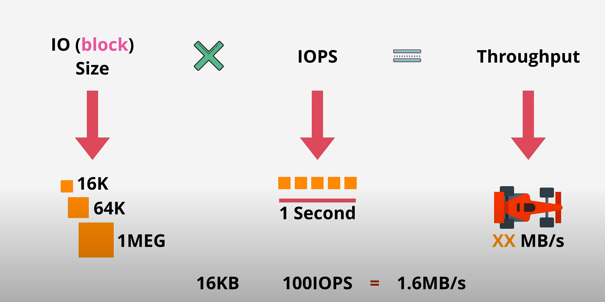

## Elastic Block Store (EBS)

**Resiliency: AZ**

- Can be enctypted using KMS

- It is attached to one EC2 instance (or other service) over a storage network, it can be used by multiple EC2 instances but you need a cluster that manges read and writes so that they don't overwrite themselves.

- They can be detached and reattached, not linked to the lifecycle of an instance.

- You can create a copy of the EBS volume to S3 in a form of a snapshot. In this case data becomes Regional Resilient, this is useful to transfer data between AZs

- Billed by GB/month metric.
  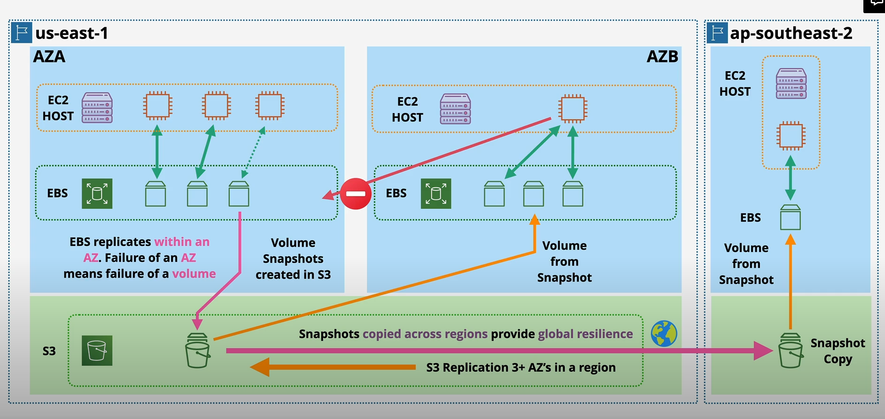

## EBS Volume Types

### GP2 (General Purpose)

- Default general purpose SSD base storage
- Small as 1GB or as large as 16 TB
- Each volume receives an initial I/O credit balance of 5.4 million I/O credits, which is enough to sustain the maximum burst performance of 3,000 IOPS for at least 30 minutes.
- Each credit I/O is of 16KiB
- It gives you a base line IOPS and if you use more than that it will refill 3 times faster It can burst uap to 3,000 IOPS in case you need it.
- The point here is to manage all of your credit buckets of all of your volumes.
- Any EBS larger than 1,000GB will ALWAYS have their baseline equal to or exceeding the burst rate of 3,000 IOPS, so they will always have credits to achieve this maximum performance.

This type of storage is currently the default, but will probably change to GP3 soon.

It is used mainly for boot volumes, low-latency interactive apps, dev & test

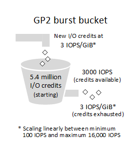

### GP3

- Newest storage type, it is also SSD based
- Removes the credit bucket architecture of GP2 to something more simpler.
- Every GP3 volume regardless of size starts with 3,000 IOPS & 125 MiB/s - STANDARD
- Base price is 20% cheaper than GP2.
- If you need more performance you can pay for up to 16,000 IOPS and 1,000 MiB/s of throughput

The usage of GP3 is for:

1. Virtual desktops
2. Medium sized single instance DBs such as MSSQL Server and Oracle DB
3. Low-latency interactve apps,
   dev & test
4. Boot volumes

### Provisioned IOPS SSD io1/2 and block express

- This volumes have SUPER high performance.
- Consistent low latency
- Usually you use them on smaller volumes that need really good performance.


### Hard Disk Drives (HDD)

- Two types of HDD:

1. st1 - Throughput Optimized (Used for Big Data) Is good for sequential access

2. sc1 - Cold HDD -> Cheapeast storage, usually is for archiving

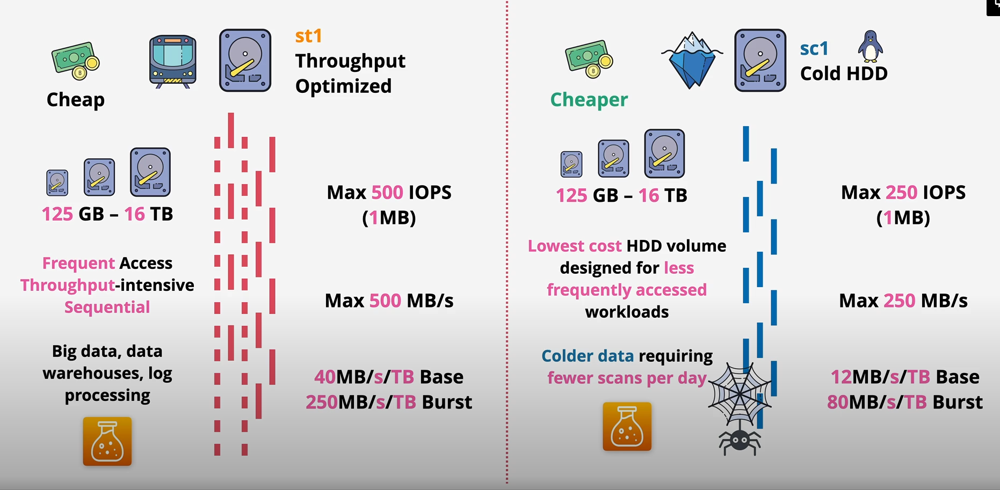

## Instance Store Volumes

- Block Storage Devices
- They are ephemeral, critical data should not live here.
- Super high IOPS
- Usually used as the basis of a FileSystem, similar to EBS, but local instead of being connected over the network
- Physically connected to one EC2 Host
- They are isolated to that one particular host
- Instance on that host can access that volume
- Since its physically connected it offers the Highest storage performance in AWS.
- They are included in the price of the instance
- Exam question: YOU NEE TO ATTACH THEM AT LAUNCH TIME ONLY, cannot be allocated afterwards.
- The amount of volumes and capacity depends 100% on the instance type, some types may not even support store volumes.

### EBS vs Instance Store

- Persistence -> EBS
- Resilience -> EBS
- Storage isolated from instance lifecycle -> EBS
- Super high performance (More than 260,000 IOPS)-> Instance store
- Cost -> Instance Store (ST1 or SC1)
- Throughput or streamng ST1
- Boot ..... NOT ST1 or SC1
- GP2/3 -> Up to 16,000 IOPS
- IO1/2 up tp 64,000 IOPS (256,000 for IO block size)
- EXAM question: You can create a RAID0 set which is a combined data storage (iop1/2, GP2/3) up tp 260,000 IOPS (This is the maximum performance an instance can give.)

### EBS Snapshot

- Snapshots are incremental volume copies to S3, this makes EBS Region resilient
- Incremental volumes mean that the first snapshot is a full copy of your data, the next ones only store the difference between the previous snapshot and the state of the volume at time of execution.
- Used for moving EBS volumes betweeen regions
- Snaps restore lazily - fetched gradually
- This can decrease performance since it will need to fetch from S3 data that has not been restored yet.
- One way of solving this is by using Fast Snapshot Restore (FSR), this provied immediate restore
- You can have up to 50 FSR per region and they are more expensive.
- You can also achieve the same result by forcing a read of every block manually using DD or another tool in the O/S. This way you save on costs but brings more admin overhead.
- You are billed by Gigabyter-month metric

### EBS Encryption

- By default it does not encrypts data at rest
- You can use a custom or the default aws/ebs KMS key for encrypting the data at rest
- When encrypted only data in the memory of the host would not be encrypted
- The key is stored right next to the EBS block and this key is encrypted by KMS
- The key is stored by the EC2 Host for encrypting and decrypting data
- each volume generates a new key
- Snapshots use the same data encryption key that the volume
- There isn't an AWS way to change a volume from encrypted to unencrypted (You need to do work arounds)
- OS isnt aware of the encryption... no performance loss (The operation happens between the EC2 Host and the volume)

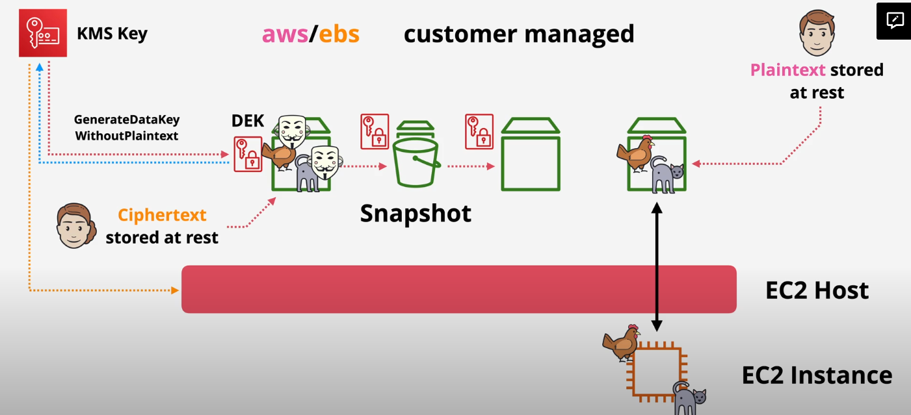

### EC2 Network Interfaces (ENI)

**LETS RECAP A LITTLE BIT**<br>
**REMEMBER... <br> Elastic IP =>**<br>
An IP that you "buy" and pay to hold it, you can assign this IP to an EC2 instance and if the instance fails you can easily boot another one and reassign it to the new instance, this way you ALWAYS have the same IP<bR><br>

**Public IP =>**<br>
An IP that is randomly allocated by AWS and might change due to stopping an instance or changing EC2 Hosts.

- Every EC2 instances has at least one ENI (Primary ENI)
- You can attach more ENIs to the instance if you want to
- The ENI is the one where the security group is attached to
- It has 1 primary Private IPv4 IP
- 0 or more secondary IPs
- 0 or 1 Public IPv4 Address
- 1 elastic IP per private IPv4 address
- 0 or more IPv6 addresses (this are public by default)
- Security groups
- Source/Destination check (If enabled it will discard traffic that does not have any of the network IPs either as source or destination in a package)
- The public IP is changed whenever you stop and start an instance (restarting does not change it)
- You get a private DNS for the Private IP e.g. IP = 10.16.0.10 DNS = ip-10-16-0-10.ec2.internal
- You also get a public DNS name for your public IP e.g. IP =3.89.7.136 DNS = ec2-3-89-7-136.compute-1.amazonaws.com
- Internally the VPC resolves any traffic from the public DNS to the private IP, and outside the VPC it resolves it to the public IP. This is REALLY IMPORTANT since this simplifies the discoverability of your instances.
- Exam question: If you attach an Elastic IP to an instance ENI, you will loose your regular Public IP address and replace it with the elastic one. AND YOU CAN GET THE PUBLIC ONE BACK!

EXAM POWER UP:

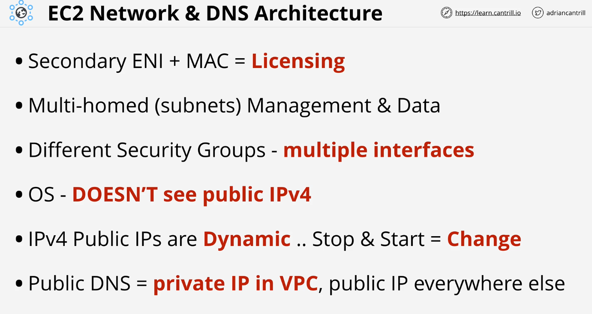

## Amazon Machine Image (AMI)

- Can be used to launch EC2 instances
- AWS or Community Provided
- Marketplace (can include commercial software) (extra cost)
- Regional .. unique ID e.g. ami-0a887e401f56493
- Permissions (Public, Your Account, Specific Accounts)
- You can create an AMI from an EC2 instance you want to template (this is so cool)

**AMI Lifecycle**

1. Launch -> You can add some volumes
2. Configure -> You can customize for your needs
3. Create Image -> Create your own AMI using that config (Snapshots are created from the volumes of the instace for other EC2 instances to use and it creates a Block Device Mapping to map the snapshot to the root of the volume e.g. /dev/xvdf)
4. Launch

**Exam PowerUp**

- AMI = One Region, only works in that one region
- "AMI Baking" .. creating an AMI from a configured instance + application
- An AMI can't be edited .. launch instanc, update config and make a new AMI
- Can be copied between regions (including snapshots)
- Remember permissions .. default = your account

The cost of an AMI is the storage capacity used by the snapshots created for the volumes.

### EC2 Purchase Options (Launch Types)

**On-Demand**

- What is it?

Shared hardware, with defined allocation (multiple customers in shared hardware)

- Pricing?

Per second billing while instance is running. Associated resources such as storage is billed regardless of instance state.

- When to use?
  Default purchase option, no interruption, no capacity reservation, predictable pricing, no discount, is good for short term workloads or unknown workloads.

**Spot pricing**

- What is it?

Selling unused EC2 host capacity for up to 90% discount - the spot price is based on the spare capactiy at a given time. If your spot price you set is lower than the current spot price, AWS terminates your instances to free up the space for people paying the actual spot price or the on-demand fee. This makes this type of instances unreliable.

- Pricing?

You pay whatever the spot price it is.

- When to use?

Things that are not time critical, anything which can be rerun. Bursty capacity needs like image or video processing.

Cost sensitive workloads and anything which is stateless.

Instance Store

- Pricing?

1. No upfront -> some savings for the agreeing to the term
2. All upfront -> means no per second fee (the chepeast of all)
3. Partial upfront -> Reduced per/s fee

- When to use?

For any components in your infrastructure that can't tolerate interrumption and you require consistent usage.

**Dedicated Host**

- What is it?

You pay for the host itself dedicated for some specific instance, it has a number of cores and cpus, memory, local storage as well as network connectivity.
You pay for the host, there are no instance charges

- Pricing?

You pay for the host per second bill, any unused capactiy is your responsibility

- When to use?

If you have software that is licensed based on sockets or cores in a physical machine.

**Dedicated Instances**

- What is it?

You dont own or share the host. You have extra charges for instances, but dedicated hardware.

- Pricing?

You pay the EC2 instancy fee plus an extra fee for the dedicated hardware

- When to use?

When you have really strict requirements where you cant share infrastructure.

## More about reserved instances

**Schedules Reserved Instances**

- Great for long term usage which doesn;t run constantly e.g. batch processing daily for 5 hourtse starting at 23:00
- You specify frequency duration and the time when it should run
- You reserve the capacity and have a slight cheaper cost.
- You need to purchase at least 1,200 hours per year and at least one year term.

**Capacity Reservations**

- You don't benefit at any cost reduction
- You only reserve an on-demand capacity to ensure you always have access to capacity in an AZ when you need it, but at full on-demand price.

**EC2 Savings plan**

- A hourly commitment for a 1 or 3 year term.
- You can make a reservation of general compute amounts ($20 per hour for 3 years) (you can save up to 66%)
- You can also choose a specific EC2 Savings Plan - flexibility on size & O/S (you can save up to 72%)
- The general compute plan works currently for EC2, Fargate and Lambda.
- Products have an on-demand rate and savings plan rate.
- Resource usage consumes savings plan commitment at the reduces saving plan rate.
- Beyond your commitment ... on-demand is used.

### Instance Status Check and Auto Recovery

The status check has 2 tests to run before it is marked as running state.

- The first status check is the system status

A fail in this check can be related to:

1. Loss of System Power
2. Loss of network Connectivity
3. Host software issues
4. Host Hardware issues

- The second status check is the instance status

A fail in this check can be related to:

1. A corrupted File System
2. Incorrect networking
3. OS Kernel issues

If one of this checks fails you can manually stop the instance and start it again or you can ask EC2 to perform auto recovery, auto recovery moves the instance to a new host, starts it up with the exact config as before. (Only works with instances that have only EBS volumes attached, no instance store volumes)

**Termination Protection**
You can protect an EC2 instance of being accidentally terminated by activating termination protection setting. You could also give a certain group of people (more senior level) the ability to disable this and a group of jr developers the ability to terminate instnces, this way the Sr developers can protect vital instances and if a jr try to terminate it it will fail and he would need his Sr to deactivate it.

### Horizontal Vs Vertical Scaling

- Vertical scaling is just adding more resources to you instance the more load you get.

- For horizontal scaling the most important part to keep in mind is to make the servers stateless by using an off-host database to store sessions (like a SQL db or Redis). If you store the sessions directly in the EC2 instance, they become stateful and whenever a client wants to come back to your site, it will loose his/her session.

### Instance Metadata (http://169.254.169.254)

- EC2 service provies data to instances
- Accessible inside all instances
- EXAM QUESTION: The IP to access instance metadata is http://169.254.169.254/latest/meta-data/
- You can access data about:

1. Environment -> e.g. Host Name, Events, SG, etc.
2. Networking -> e.g. IPv4
3. Authentication -> Roles that the instance have
4. User-Data -> Grant Access
5. Exam question: The metadata is not authenticated nor encrypted. Anyone who can connect to the instance via ssh can enter the metada information. You can restricit from local firewalls, but that extra admin overhead per instance.

## Containers & ECS

### Benefits of containers

- Lightweight -> It doesn't have its own O/S
- They are portable (self-contained)
- Always run as expected

### ECS

**ECS is to containers what EC2 is to VMs**

- ECS Clusters runs in 1 of 2 modes:

  1. EC2 instances as container hosts.
  2. Fargete mode, serverless way, AWS manages the container host part.

- Container Definition -> Pointer to a Docker image and exposes ports.
- Task Definition -> Store resources, compatibility, network, roles of the containers being runned.
- Task Role -> are the best way for giving containers within ECS permissions to interact with other AWS services.
- Service Definition -> How we want a task to scale, copies running, capacity, etc. You can even deploy a load balancer in front.
- You deploy either tasks or services into an ECS cluster.

### ECS Cluster Types
**Common features**

- Both clusters have:
  1. ECS Management components:
      - Scheduling and Orchestration
      - CLuster Manager
      - Placement engine

**EC2 Mode**
- Runs whitin a VPC so it is regional (has multiple AZ available)
- It has an Auto Scaling Group to add and remove instances
- It is not serverless since you still have the EC2 instances
- Helpful when someone already has EC2 instances running but want to containerize their application


**EC2 Fargate**
- Serverless, since you don't have an actual EC2 instance
- Task and Services are running inside a shared infrastructure platform and then they are injected to your VPC.
- You only pay for the container resources you are using.


#### When to use EC2, ECS (EC2) or Fargate?

If you use container pick ECS:
- Large workload and price conscious - EC2 Mode
- Large workload, overhead conscious - Fargate
- Small/Burst workloads - Fargate
- Batch/Periodic workloads - Fargate

## Advanced EC2
### EC2 Bootstrapping

- Bootstrap is a general term, in system automation, bootstrapping is a process that allows system to self configure or perform some self configuration steps. (software installations, etc.)

- You can use User Data to do this bootstrapping, this data is accessed via the meta-data IP

- ANYTHING in User Data is executed by the instance O/S ONLY AT LAUNCH TIME (not restarting)

- EC2 doesnt interpret, the OS needs to understand the User Data.

- If the bootstrap fails (User Data), the instance will still be in a running state, so you would not know by looking at the state of the instance.

- User Data is NOT secure

**AMI Baking or Bootstrapping?**

- Usually you want to AMI bake all the installation processes (these are the ones that take most of the time) and leave only the configuration part as bootstrap (this way you have more control over the config)


### AWS::Cloudformation::Init
Is a way to pass complex bootstrap instructions to an EC2 instance.

- cfn-init helper script - installed on EC2 O/S
- Simple config management system
- Procedural (User Data) vs Desired State (cfn-init)
- It makes sure Packages are installed, can create users and groups, can crate files with certain content and permissions, etc.
- It is executed as any other command by being passed into the instance as part of the user data, it retrieves its directives from the cloudformation stack, the directive is **AWS::Cloudformation::Init**
- It works with stack updates, so if you update your stack it will catch the changes and update the instances.
- You can use cfn-signal to send a signal to AWS confirming that your userdata and AWS init ran correctly. You specify a timeout, so that if nothing happens in X amount of time, then Clouformation assumes is an error and wont complete the stack creation.


### EC2 Instance Role & Instance Profile
**ROLES ARE ALWAYS PREFERRED THAN STORING ACCESS KEYS INTO AN INSTANCE**

Roles that an instance can assume and anything running in that instance have the permissions granted


- There is an IAM Role and that IAM role has some permissions policies attached to id
- Whoever assumes the role gets temporary credentials generated.

- An instance profile is what gives the permissions to the applications inside the instance, this is generated automatically if you do thi in the UI, but if you are doing it declarative, you need to define them yourself

- These permissions are delivered via the instance metadata (iam/security-credentials/role-name)

- The credentials are automatically renewed, so as long as your application keep checking the metadata it will always have working creds.


