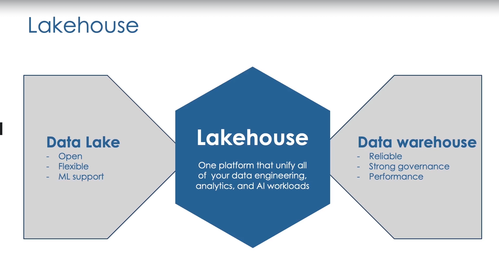
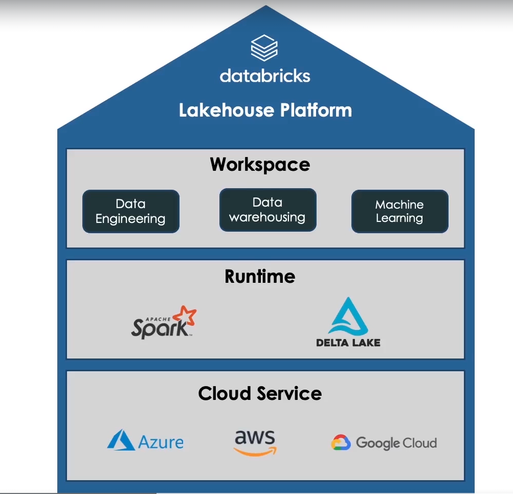
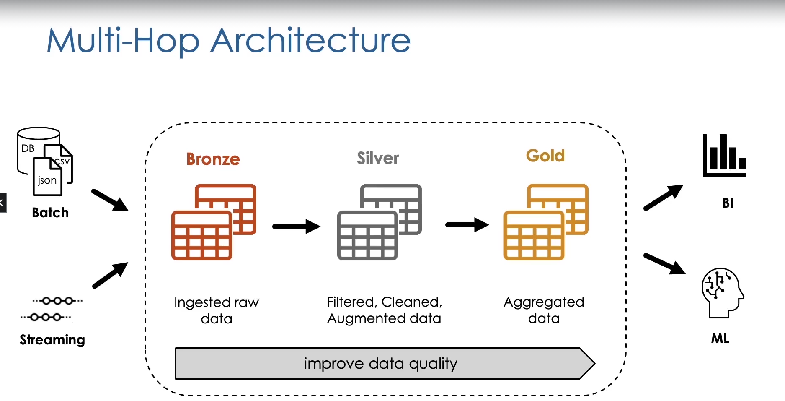

# Databricks - Data Engineer Associate

## What is Databricks?
It is a multi-cloud Lakehouse Platform based on Apache Spark


Architecutre of Databricks LakeHouse



Databricks generates resources in their account as well as in your cloud provider account.

In your account it deploys:
- A web UI
- Cluster Management
- Workflows
- Notebooks

In your cloud account it deploys:
- Cluster of VMs
- Storage (DBFS) - DataBricks File System

In summary, compute and storage will be in your own cloud account and DataBricks will provide the tools to use and control your infrastructure.

### More about DataBricks
Databricks was founded by the same engineers that created Apache Spark, that's why it supports the same languages that Spark, which are:

- Scala
- Python
- SQL
- R
- Java

It also supports:
- Batch Processing
- Stream Processing

Data could be:
- Structured
- Semi-Structured
- Unstructured (images & videos)

### DBFS
- It is a distributed file system
- Preinstalled in Databricks Cluster
- It is an abstraction layer, under the hood data is persisted to the underlaying cloud storage


## DataBricks Lakehouse Platform
### Delta Lake
- Delta lake is an open source storage framework that brings reliability to data lakes, since data lakes have many limitations like:
    - data inconsistency
    - performance issues

- What is it?
    - Open source tech
    - Storage framework/layer
    - Enabling building Lakehouse

- What is NOT?
    - Propietary tech
    - Storage format/medium
    - Data warehouse/Database service


- Is a component which is deployed in the cluster as part of the databricks runtime

- It gets stored as files in parquet format, it also stores transaction logs which act as the source of truth. 

### Transaction log (Delta log)
- Ordered records of every transaction
- Single source of truth
- Each commited transaction is stored as a JSON which contains:
- Operation performed (conditions and filter used)
- data files touched

### Write/Reads
There is a writer process and a reader process

The writer process:
1. Writes data
2. Adds transaction logs

The reader process
1. Read transaction log
2. Read data files

### Updates
Whenever you update the data, delta lake copys and updates the files needed into new files, and add this to the transaction log

When the reader process kicks in, it will now read the data from the new updated files, but the old files are kept as well for versioning purposes.

### What happens with simultaneous write/reads?
In this case the reader process will get the files needed from the transaction log while the writer process is still writing the new file. You will never encounter death locks, and once the writer process finishes it will add the new transaction log for the next read.

### What happends with Failed Writes?
It will simply not add any transaction logs so the new file that was corrupted/failed will never be read.

### Delta Lake Advantages
- Brings ACID transactions to object storage
- Handle scalable metadata
- Full audit trail of all changes
- Builds upon standard data formats: Parquet + JSON


### Time travel
- Audit data changes (DESCRIBE HISTORY command)
- You can query older versions of the data by:
    - Using a timestamp in your select statement
    - Using a version in your select statement table
- It also helps to do rollback versions with the (RESTORE command)

### Compaction
- Compacting Small filles into bigger files (improve performance)
- This can be run using the OPTIMIZE command

### Indexing
- Co-locate column information in the same set of files
- This can be done with the OPTIMIZE command with the parameter ZORDER BY column_name, this will order the parquets by the column you specified which will make querying way much faster (skips a lot of files for scanning)

### Vacuum a Delta table
- This cleans up unused data files
    - uncommitted files
    - files that are no longer in in latest table state

- VACUUM command
    - It has a default retention periods of 7 days (can be changed)

**If you Vacuum a table you no longer have the ability of time travel on that table**


## Relational Entities
### Database
- In Databricks Databases are schemas in Hive metastore
- This is why you can use the following syntaxes:
 - CREATE DATABASE db_name
 - CREATE SCHEMA db_name

### Hive metastore
- Repository of metadata:
    - DBs
    - tables
    - format
    - Where they are stored

Every Databricks workspace has a central Hive metastore accesible by all clusters to persist table metadata.

By default you have a database called default. (dbfs:/user/hive/warehouse)


### Tables
In DataBricks there are 2 types of tables:
- Managed Tables
- External Tables

**Managed Table**
- It's the default case, it is when the table is created under the database directory
- When dropping the table, it deletes the underlying data files

**External Table**
- Table is created outside the database directory
- When dropping a table, it does not deletes the underlying data files

### CTAS
- It is a CREATE TABLE_AS SELECT 
- Automatically infere schema information and inserts data to new table

### Table Constraints
Databricks support:
- NOT NULL constraints
- CHECK constraints

Alter table table_name ADD CONSTRAINT valid_date CHECK (date>'2020-01-01')

First make sure no data in the table is violating the constraint, then new data being write to the table that violates the constraint would result in a fail write.

### Cloning Delta Lake Tables
- Deep Clone - Fully copies data + metadata from a source table to a target table, can sync changes, takes a while for large datasets
- Shallow Clone - Quickly create a copy of a table, it just copy the Delta transaction logs. It is a good option to test out applying changes on a table wihtout the risk of modifying the current table.

- Cloning is a good way to copy production tables for testing your code in development

## Views
A view in DataBricks is a virtual table that has no physical data, it is just a saved SQL query that is executed each time a View is queried.

There are 3 types of Views in DataBricks:
1. Stored Views - Persisted View
2. Temporary View - Tied to a Spark session, where a spark session is created when opening a new notebook, when detaching and reattching to a cluster, installing a python package, restarting a cluster.
3. Global Temporary Views - It is tied to a cluster, any notebook has access to it.


## Querying Files
For querying files you can specify the format and the location. You can also create a table by naming the columns, specifying the data_source (CSV, JDBC) LOCATION to specify where this CSV are going to be stored.

- This type of tables are External Tables since the underlying data is not living under the table (there is no data moving)
- The files are kept in their original format (Non-Delta Table)

- Since this type of tables are not Delta Tables we can't expect the performance guarantees associated with them like:
    - Time tavel
    - Guarantee of most recent version of data.
    - It can have peformance issues

The solution for this is to create a temporary view for this data source and then create a table from that view. This way you are extracting the data from an external data source and loading it into a Delta Table.

### Merging
Use the MERGE INTO operation to avoid duplicates, this way you can specify the condition on when you don't want to insert certain records and maybe you just want to update the matching record with new information from the table to be merged and in case there is no match then you insert.

## Advanced Transformations
- use "**:**" to traverse nested jsons e.g 

    ```
    SELECT
        customer_id,
        profile:name,
        profile:address:country
    FROM customers
    ```

- from_json -> parses json to struct types (struct is a native spark type with nested attributes), you need to provide the schema by using **schema_of_json** function. With struct type you can use the syntax **profile_struct.address.country** instead

- Once a json field is converted to a struct type you can use the * operator to flatten fields, like so:

    ```
    SELECT profile_struct.* FROM parsed_customers
    ```


- When dealing with arrays you can use the **explode** function to make each element of the array into its own row

- **collect_set** -> You can use this aggregation function to collect unique values for a field.
    - e.g.

        ```
        SELECT 
            customer_id, 
            collect_set(order_id) AS order_set, 
            collect_set(books.book_id) AS books_set 
        FROM orders GROUP BY customer_id
        ```

- **flatten** -> flats out an array of arrays

### Set operators
Spark SQL also supports set operations like:
- Union
- Intersect
- Minus

### Pivot
Spark SQL supports Pivot which is used to change data perspective. You can get aggregated values based on a specific column

## Higher Order Functions
**FILTER**

You use a lambda function to filter the rows and create a new column

e.g.
```
SELECT
    order_id,
    books,
    FILTER(books, i -> i.quantity >= 2) as multiple_copies
FROM orders
```


**TRANSFORM**

It is used to a transformation on all the items of an array and extract the transformed value

e.g.
```
SELECT
    order_id,
    books,
    TRANSFORM (
        books,
        b -> CAST(b.subtotal * 0.8 AS INT)
    ) AS subtotal_after_discount
FROM orders;
```

**User Defined Functions (UDFs)**

Allows you to register a custom combination of SQL logic as function in a database, making these methods reusable in any SQL query

e.g.
```
CREATE OR REPLACE FUNCTION get_url(email STRING)
RETURNS STRING

RETURN concat("https://www.", split(email, "@")[1])
```
These are permanent persisted functions that can be reused in different sessions and notebooks.

## Incremental Data Processing
### Structured Streaming
**What is a Data Stream?**
- Any data source that grows over time
    - New files landing in cloud storage
    - Updates to a DB captured in a CDC feed
    - Events queued in a pub/sub messaging feed

There are 2 approaches:
1. Reprocess the entire source ataset each time
2. Only process those new data added since last update.
    - Spark Structured Streaming

Spark Structured Streaming is a scalable streaming processing engine, it allows you to query an infinite data source where automatically detects new data and persist the result.

- It treats the infinite Data as a Table
- New data is treated as new rows in the table

We can use spark.readStream() to query the Delta Table as a stream source, which allows to process all of the data present in the table as well as any new data that arrives later. It creates a data frame which allow us to apply any transformation as if it was just a static dataframe.

To persist the result of the stream, we can use the writeStream method to ouput it into a table

You can use a fixed interval, triggered batch by either micro-batches or all available data.


### Checkpointing
DataBricks create checkpoints by storing the current state of your streaming job to cloud storage, it allows the streaming engine to track the progress of your process.

### Guarantees
1. Fault Tolerance
    - Checpointing + Write-ahead logs
        - record the offset range of data being processed during each trigger interval

2. Exactly-once guarantee
    - Idempotent sinks (multiple writes of the same data do not result on duplicates being written to the sink.)

### Unsupported Operations
- Some operations are not supported on streaming DFs
    - Sorting
    - Deduplication

- There are advanced methods for accomplishing that, like:
    - Windowing
    - Watermarking
    

## Incremental Data Ingestion
- The ability to load data from new files that have been encountered since the last ingestion.

- Databricks provides 2 mechanisms:
    - COPY INTO
    - Auto loader

**COPY INTO**
- This is a SQL command that allow suser to load data from a file location into a Delta Table.
- Loads new data files idempotently and incrementally. This means that skippes files that have already been loaded.

**Auto Loader**
- Uses structured streaming in Spark
- Can process billions of files
- Support near real-time ingestion of millions of files per hour.
- Store metadata of the discovered files
- Exactly-once guarantees
- Fault tolerance.

For this we use readStream and writeStream methods.


**When to use Auto Loader vs COPY INTO?**
- If you are going to ingest file in order of thousands, you can use the COPY INTO command.

- If you are expecting files in order of millions or more over time, use Auto Loader.

- In addition, auto loader can split the processing into multiple batches so it is more efficient at scale.

- Databricks recommends to use Auto Loader as general best practice when ingesting data from a cloud object storage.


## Multi-Hop Architecture
- A multi hop architecture, also known as Medallion architecture, is a data design pattern used to logically organize data in multilayered approach.

- Its goal is to incrementally improve the structure and the quality of the data as it flows through each layer of the architecture.

- Multi hop architecture usually consists of three layers: 
    - Bronze
    - Silver
    - Gold

**Bronze table**
- Contains raw data ingested from various sources.
- Like json files, operational databases, or Kafka Stream, for example.

**Silver table**

- Provides more refined view of our data. 
- For example, data can be cleaned and filtered at this level.
- And we can also join fields from various brands table to enrich our silver records.

**Gold Table**
- Provides business-level aggregations, often used for reporting and dashboarding or even for machine learning.

**SUMMARY**

- With this architecture, we incrementally improve the structure and the quality of data as it flows through each layer.

- There are many benefits for multi hop architecture.

    - It is a simple data model that is easy to understand and implement.

    - It enables incremental ETL.

    - It can combine streaming and batch workloads in the same pipeline.

    - It can recreate your tables from raw data at any time.




## Delta Live Tables (DLT)
- Simplifies the work of building large scale ETL while maintaining table dependencies and data quality.
- They are implemented using databricks notebooks
- You can use the **cloud_files** method to enable auto loader to be used natively with SQL e.g.
```
CREATE OR REFRESH STREAMING LIVE TABLE orders_raw
AS SELECT * FROM cloud_files("path/to/files", "parquet", 
                                map("schema", "order_id" STRING, ...))
```


You can also create constraints for data cleaneaning direcly using SQL like so:

```
CREATE OR REFRESH STREAMING LIVE TABLE orders_cleaned (
    CONSTRAINT valid_order_number EXPECT (order_id IS NOT null) ON VIOLATION DROP ROW
)
AS
    SELECT ...
    FROM STREAM(LIVE.orders_raw) o
    LEFT JOIN LIVE.customers c
        ON o.customer_id = c.customer_id
```

Note how we need to use the LIVE prefix to refer to other DLT tables.


## Change Data Caputre (CDC)
- Is the Process of identifying changes made to data in the source and delivering those changes to the target.
- They can be additions, updates or deletions
- Changes are logged at the source as events that contain both the data of the records and the metadata information.
- Delta Live Tables supports CDC via APPLY CHANGES INTO command.

