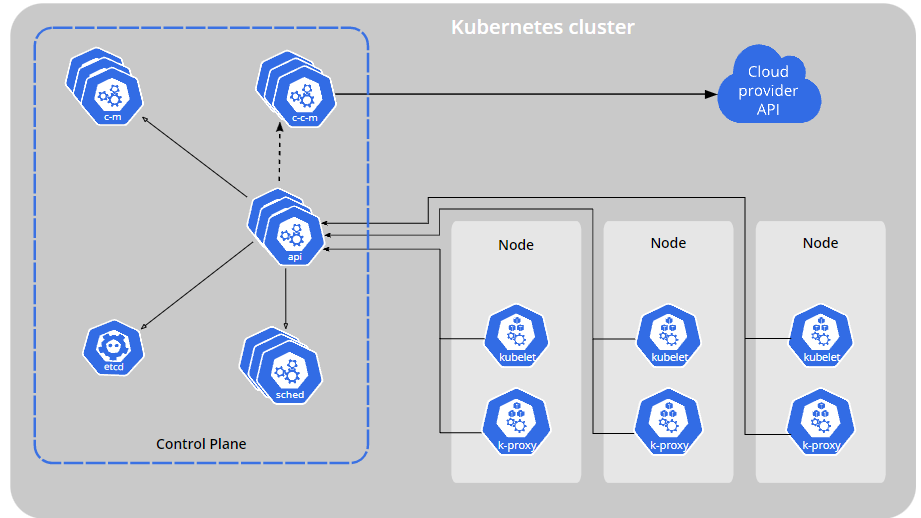

# What is Kubernetes
- Kubernetes is a portable, extensible, open source platform for managing containerized workloads and services, that facilitates both declarative configuration and automation.

- Additionally, Kubernetes is not a mere orchestration system. In fact, it eliminates the need for orchestration. The technical definition of orchestration is execution of a defined workflow: first do A, then B, then C. In contrast, Kubernetes comprises a set of independent, composable control processes that continuously drive the current state towards the provided desired state.


## Kubernetes Components
The components you need to have for a complete and working Kubernetes cluster.


- Control Plane (master node) -> Manages, monitors, plans and schedules nodes, it has the following sub-components:
    1. etcd (key-value store) Used for critical info.
    2. kube-scheduler -> Watches for newly created Pods with no assigned node, and selects a node for them to run on.
    3. kube-apiserver -> This component exposes the Kubernetes API. Is the front end for the Kubernetes control plane.
    4. kube-controller-manager -> Runs controller processes, e.g.

            a) Node controller - notices and responds when a node goes down
        
            b) Job controller - watches for job objects then creates pods to run them
            
            c) Endpoints controller - Populates the endpoints object (joins Services and pods)
    5. cloud-controller-manager -> Only used if you have a cloud provider, it seperates the components that need to interact only with the cloud and the ones that only interact with you cluster.


- Node Components -> These are components that run on every node, mantaining runnin gpods and providing the Kubernetes runtime environment.
    1. kubelet -> An agent that runs on each node, it makes sure that containers are running in a pod.
    2. kube-proxy -> Network proxy that runs on each node in your cluster. It maintains network rules on nodes, these rules allow network communication to your Pods from network sessions inside or outside your cluster.
    3. Container runtime -> software responsible for running containers (e.g. Docker)

- Addons -> Cluster features e.g. CoreDNS (DNS Server which can be installed), Dashboard (Web dashboard interface for Kubernetes), etc.


## Nodes
 A node may be a virtual or physical machine, depending on the cluster. Each node is managed by the control plane and contains the services necessary to run Pods.


 There are two main ways to have Nodes added to the API server:

1. The kubelet on a node self-registers to the control plane.
2. You (or another human user) manually add a Node object


e.g. of a declaration of a node manifest:
```
{
  "kind": "Node",
  "apiVersion": "v1",
  "metadata": {
    "name": "10.240.79.157",
    "labels": {
      "name": "my-first-k8s-node"
    }
  }
}
```
After creating a Node object, control plane checks if the new Node object is valid by checking that kubelet has registered it to the API server that matches the `metadata.name` field of the Node. If the node is healthy then it is eligible to run a Pod, otherwise it is ignored until it becomes healthy.

**Naming**

The name identifies a Node. Two Nodes cannot have the same name at the same time. Kubernetes also assumes that a resource with the same name is the same objec


