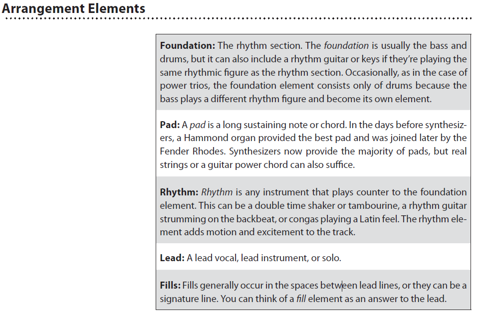

# Mixing
## Notes from "The Mixing Engineer handbook"

- Most great mixers think in three dimensions. They think “tall, deep,
and wide,” which means making sure all the frequencies are represented,
making sure there’s depth to the mix, and then giving it some stereo
dimension.

    - The **“tall”** dimension (which is called frequency range later in the book)
    is the result of knowing what sounds right as a result of having a reference
    point. Usually that means that all the sparkly, tinkly highs
    and fat, powerful lows are there. Sometimes it means cutting some mids.
    Clarity is what you aim for.

    - You achieve the effects or **“deep”** dimension by introducing new ambience elements into the mix. You usually do this with reverbs and delays.

    - The panning or “wide” dimension is placing a sound element in a soundfield in a way that makes a more interesting soundscape, such that you can hear each element more clearly.

### Signs of an Amateur Mix:
- **No contrast:** The same musical texture permeates the entire song.

- **A frequent lack of focal point:** The lyrics have holes where nothing is brought forward in the mix to hold the listener’s attention.

- **Mixes that are noisy:** You can hear clicks, hums, extraneous noises, countoffs, and sometimes lip-smacks and breaths.

- **Mixes that lack clarity and punch:** Instruments aren’t distinct. The low end is either too weak or too strong.

 - **Mixes that sound distant and are devoid of a feeling of intimacy:** The mix sounds distant because of too much reverb or overuse of other effects.

- **Inconsistent levels:** Instrument levels vary from balanced to soft or too loud. Certain lyrics can’t be distinguished.

- **Dull and uninteresting sounds:** Generic, dated, or often-heard sounds are used. There’s a difference between using something because it’s hip and new and using it because everyone else is using it.

### The Six Elements of a Mix
Every piece of modern music—meaning has six main elements to a great mix:
- **Balance:** The volume level relationship between musical elements
- **Panorama:** Placing a musical element in the soundfield.
- **Frequency range:** Having all frequencies properly represented
- **Dimension:** Adding ambience to a musical element
- **Dynamics:** Controlling the volume envelope of a track or instrument
- **Interest:** Making the mix special

### Element 1: Balance — The MixingPart of Mixing
- Good balance starts with good arrangement. It’s important to understand arrangement because so much of mixing is subtractive by nature. This means that the arrangement, and therefore the balance, is changed by the simple act of muting an instrument whose part doesn’t fit well with another.

- When two instruments that have essentially the same frequency band play at the same volume at the same time, the result is a fight for attention.

- Most well-conceived arrangements are limited in the number of elements that occur at the same time. An element can be a single instrument like a lead guitar or a vocal, or it can be a group of instruments like the bass and drums, a doubled guitar line, a group of backing vocals, and so on. Generally, a group of instruments playing the same rhythm is considered an element.

### Arrengement Elements

### Ways to Prevent Instrument Fighting
• Change the arrangement and re-record the track.

• Mute the off ending instruments so that they never play at the same
time.

• Lower the level of the off ending instrument.

• Tailor the EQ so that the off ending instrument takes up a diff erent
frequency space.

• Pan the off ending instrument to a diff erent location.

**Vocals first**

- Wherever you start from, mixers generally agree that the vocal, or whatever is the most prominent or significant melody instrument, has to make its entrance into the mix as soon as possible. The reason for this is
two-fold

    - First of all, the vocal is probably going to be the most important element, so it will take up more frequency space than other supporting instruments. If you wait until late in the mix to put the vocal in, there might not be enough space left, and the vocal will never sit right with the rest of the track.

    - The second reason has to do with effects. If you tailor all your effects to the rhythm section and supporting instruments, there might be none left when it’s time to add in the vocal or most prominent instrument.

### Element 2: Panorama—Placing the Sound in the Soundfield