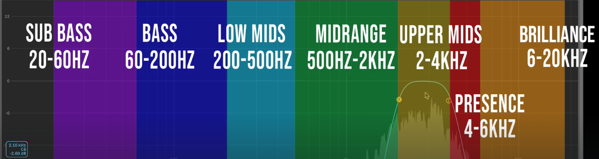

# Seed to Stage - Mixing and Mastering Course
## The frequency spectrum

### SUB
- This area is non-audible in many devices, it is more felt than heard. It is audible mostly in PA (Public Access) systems (clubs, festivals, etc.)

### Bass
- This is where the root notes (fundamentals) of certain elements live, like the bass, kick and snare. It is audible in any kind of device

### Low Mids
- Highly disputed area, your bass instruments and your melodic instruments are competing for this area, a lot of the time in mixing is spent in here.
- You can here the first harmonics

### Mid Range
- Very sensitive to ear
- Where the vocals mostly live
- A lot of competition between elements
- Can make elements dominate or step back in the mix.

### Upper Mids
- EXTREMELY sensitive area for humans (kind of where a baby cry)
- Its usually the clack or smack of drums (clarity of kick drums and snare drums)

### Presence
- This is where we hear detail of music, it gives definition of sound.
- Great place to accent an instrument.

### Brilliance
- No fundamental frequencies
- It is "the air, the breath, or the wind"
- Can add a Hi-Fi or be harsh if it's too loud

## The Stereo Image
### What is stereo
Stereo refers to audio that has a sense of space or 3 dimensions.

We can accomplish this by using choruses, panning with delays or multiple voices detuned (unison)

### Panning
Panning is a technique used to send a signal more or less to one speaker (Left or Right)

We can hard pan (send it only to one speaker) or pan only a bit (will sound more in one speaker than the other)

### Phantom center
When we play audio in a system that has more than one speaker (headset, monitors, club PA, etc) we can make a sound feel like it is actually coming from the center, even though the speakers are at the sides.

This is called the "Phantom Center" and is achieved by playing the exact same signal in both left and right sides.

We want certain elements to feel more wide (like the sound is coming from the sides) and this is where we use the stereo image to take advantage of that.

### Phase
The phase of the signal is the point in time where the signal is, you could imagine as if you stop the song in a precise moment and look at both the left and right singal, whatever point of the soundwave they are at, that will be their phase

We say that the signals are out of phase when the L/R speakers are playing different things (either one of them has certain instruments more panned to it or maybe we added some unison to a synth which causes detuned voices in one of the speakers, etc.)

### What is Mono
Mono is when we sum both left and right signals to only have one signal.

This is how certain audio playback systems work (alexas, single speakers, laptops, phones, some clubs sound systems, etc.)

### Phasing Issues
Ideally we will want our listeners to always listen to ours songs in stereo, in reality, much of the time the listeners are playing the song in mono devices, so we need to make sure our song sounds good in mono.

Phasing issues happen when we pass our signal from stereo to mono, if the signals are out of phase (some delay in one  of them) certain frequencies will be reduced in volume, A.K.A phase cancelled (something positive + something negative) but other frequencies will be actually boosted (something positive + something even more positive)

This phenomenon is known as **Comb Filtering**

This makes our instrument/song sound thin in certain parts but overly loud (even resonant) in other parts,which could potentially ruin your mix, but if used wisely it could be part of your sound desing.

To accomplish that you need to play with the filter of the delay, and the delay times (dry and wet signal).

### Mid Sides EQ (M/S)
This option in the EQ lets us hear all the information that is in phase (mono - Mid) and all the inforamtion that is out of phase (Stereo - Sides)

